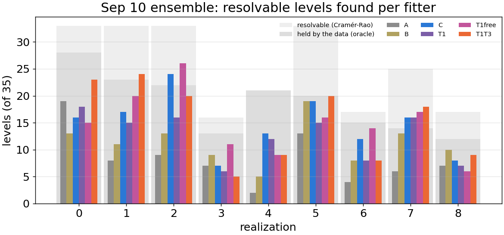
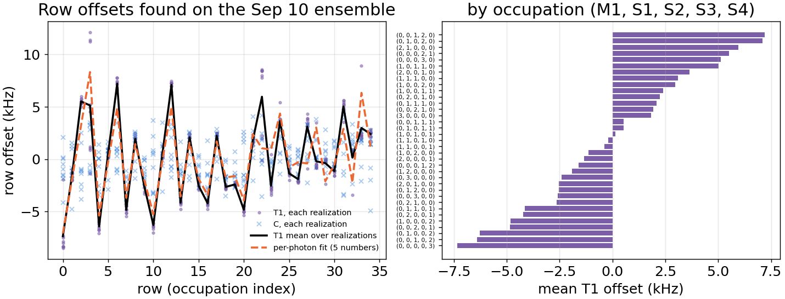
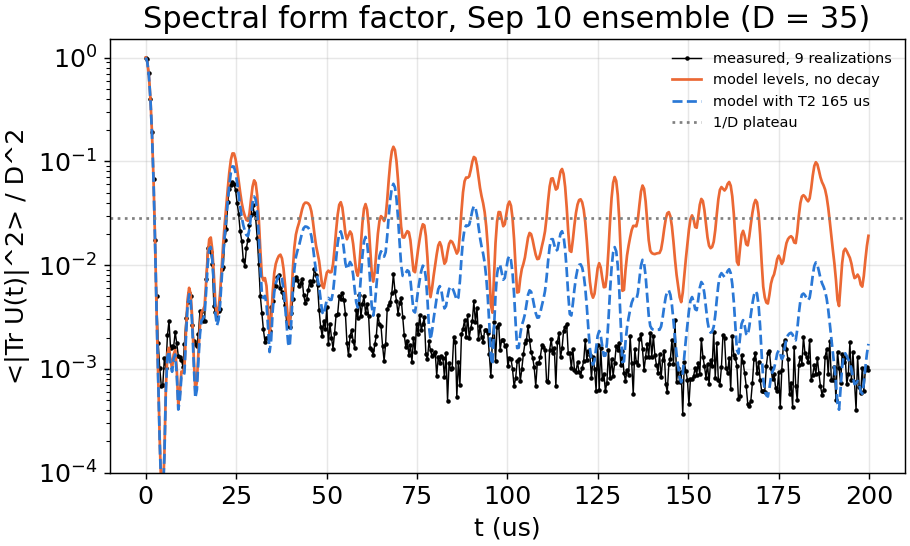
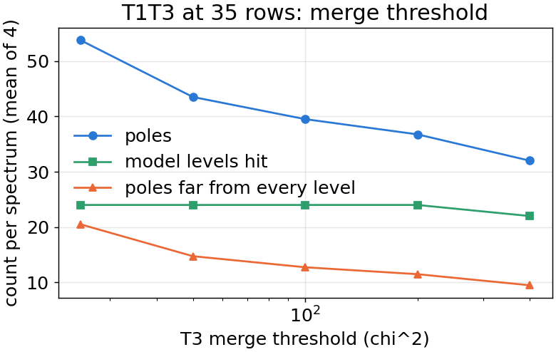
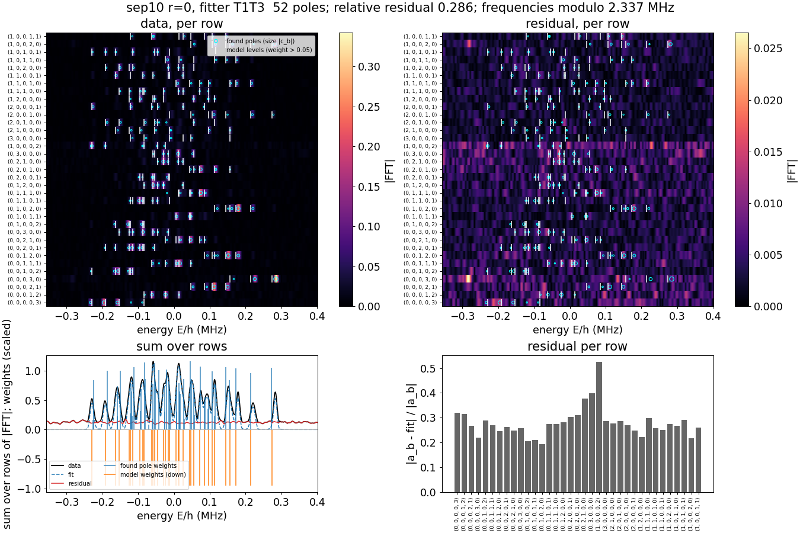

# Pole finding: recap of every method tried (2026-10-03)

Status: recap, 2026-10-03 (guan and Claude). A reading aid, not a spec: what each method does,
what it was tested on, and how it did. The spec is `pole_finding.md`; the exploration plan is
`pole_finding_explore.md`; the day-by-day record is `../log/2026-09-2*_pole-finding-*.md` and
`../log/2026-10-02_sep10-pole-survey.md`. Figures: `figures/pole_finding/`.

## 1. The problem, in one line

Each measured occupation row $b$ gives a complex return on a uniform time grid,

$$A_b(t) = \sum_\lambda c_{b\lambda}\, e^{(-\gamma_\lambda - 2\pi i E_\lambda) t},
\qquad c_{b\lambda} = \langle b | P_\lambda | b\rangle \;\; (\text{diagonal row, normalized to } A_b(0)),$$

with the same poles $(E_\lambda, \gamma_\lambda)$ in every row. We want the levels $E_\lambda$,
and from them the level statistics: the small-gap tail $P(r < 0.25)$ of the adjacent gap
ratio $r_n = \min(s_n, s_{n+1}) / \max(s_n, s_{n+1})$, compared with the model's own value.

Two things go wrong, in opposite directions:

- **Merging.** Two levels closer than the resolution become one pole. Small gaps vanish, the
  spectrum looks *more repelling* (Michaille and Pique). Every pencil-type method does this.
- **False poles.** Noise or model error gives extra poles at random places, the spectrum looks
  *more Poisson*.

A third thing, found on the way, is the main story of this document: **each row sits in its
own frequency frame**, offset by $\delta_b$ (the residual error of the Stark-shift
calibration of that occupation), so row $b$ sees every pole at $E_\lambda + \delta_b$.

## 2. What the methods were tested on

| Data | What it is | Why it matters |
|---|---|---|
| Benchmark 1 (synthetic, clean) | 40 model cases, 400 samples, no noise | exactness of a pencil |
| Benchmark 2 (synthetic) | the $(K/g, \delta/g)$ plane, 20 draws x 2 seeds, SNR 13-300, decay, row offsets $\sigma$ = 0, 0.5, 1.06 kHz; 100-400 samples | resolution and bias vs window, noise, offsets |
| **T0 fixed set** (synthetic) | 80 cases: August point ($g$ 8.6 kHz, $K/g$ -1.2) and September point ($g$ 29.2 kHz, $K/g$ -0.13), $T_2$ 100 / 200 us, offsets 0.5 / 1 kHz, 10 / 35 rows, 5 draws; C's fits cached | the common score sheet; every fitter from T0 on is scored here first |
| `diagonal_disorder_71` (real) | 19 realizations x 10 rows, 100 samples, 12 kHz bins | the published-style campaign; its window loses the small gaps for every method |
| `august_N3`, `august_disorder` (real) | complete N=3 basis (10 distinct levels) and 4 realizations x 10 rows, 300 samples, 2.3 kHz bins | first real tests of B, C, F, T1 |
| **`sep10_full_K3p6_g29p2`** (real) | 9 realizations x **35 rows** (complete basis), 468 samples at 0.428 us, 5 kHz bins, 35 distinct levels each | the first complete-basis disorder data; the 2026-10-02 survey ran everything on it |
| `august25_N3` (real) | complete N=3 basis, $g$ 15 kHz | quality concern confirmed (section 6) |

Scores: on synthetic data, gaps found of the *resolvable* gaps (Cramér-Rao, section 3),
false poles, $P(r<0.25)$ found vs true. On real data: the spec 5.5 diagnosis (resolvable /
held by the data / found), the in-band residual over the out-of-band noise, pole weights
against multiplicities (complete basis), $P(r<0.25)$ against the model's.

## 3. The yardsticks (not fitters)

- **Cramér-Rao resolvability** (`resolution.py`, spec 5.5). The Fisher matrix of all
  frequencies, decays and row offsets at the model's levels and the measured noise; a gap is
  resolvable if it is at least 4 of its own error. No unbiased method does better. Tells "the
  data cannot" from "the fitter did not".
- **Per-level diagnosis** (`diagnosis.py`, `diagnose_levels`). Per model level, in order: in
  the measured rows? resolvable? held by the data (C's refinement started *at* the model keeps
  it there with weight)? found by fitter X? The first failed check is the cause of a miss;
  "search" means the fitter alone is at fault.
- **Design calculator** (`design.py`, spec 5.6). The same bound with the amplitudes as
  explicit parameters, so that assumptions enter: complex (what every pencil assumes), real
  ($\langle b|P_\lambda|b\rangle$ is real for a diagonal row), real with column sums
  $\sum_b c_{b\lambda} = m_\lambda$ (complete basis); offsets free per row, or a per-photon
  pattern $\delta_b = \sum_i n_{b,i}\,\varepsilon_i$.
- **Gap score** (`gap_score.py`, T0). Levels matched in order with a tolerance of half the
  nearest gap and one common frame shift; gaps found, errors over the bound, small gaps
  resolved, false poles, $P(r<0.25)$.

## 4. The methods

### A. Current Matrix Pencil, per row, reconciled (`per_row_reconciled.py`, frozen)

*Procedure.* Per row: Hankel matrix, SVD, a rank sweep; poles from the shift invariance; the
rows' pole tracks are reconciled across rows within a tolerance, capped at $D = 35$ poles.
Two settings sets: the 7-1 campaign's (`CAMPAIGN_SETTINGS`, 0.1-bin dedup) and the 7-1
analysis notebook's (`ANALYSIS_SETTINGS`, 0.5 bin).

*Tested on.* Benchmarks 1-2, all real sets, the survey.

*Performance.* Resolves close levels better than B on clean long windows (24.8 of 35 at 400
samples), but half its poles are false on the measured grid (14.5 of 35 at 100 samples), and
its $P(r<0.25)$ bias is *positive* and does not shrink with the window. On the Sep 10 set:
20 of 35 levels hit, in-band residual 5 times the noise (max 31), the worst of all fitters
(92 found over 9 realizations, 108 resolvable levels missed by search). Three known defects,
strict xfails. *Verdict: the reference, to be retired.*

### B. Joint pencil (`joint_pencil.py`)

*Procedure.* Normalize rows to $A_b(0)$; stack the Hankel matrices of all rows,
$H = [H_1; \dots; H_R]$, which share the right factor $z^k$; one SVD; rank by MDL (threshold
rule as an option); poles from the shift invariance; amplitudes per row by least squares.
Free parameters: rank rule, pencil length $L$ ($2N/3$).

*Tested on.* Benchmarks 1-2, `tune_b.py`, all real sets, the survey.

*Performance.* Exact on clean data (below $10^{-6}$ bin). Fewer false poles than A, 50-100
times faster, no cap. Its bias is negative (merging) and goes to 0 as the window grows.
**Breaks under row offsets**: at $\sigma$ = 0.5 kHz resolved levels fall 25.7 to 12.0 (synthetic
August), because one level seen at different frequencies in different rows is not one
exponential. On Sep 10: 24 of 35 hit, 22 far poles per spectrum, 0.2 s. *Verdict: the fast
start that C, F and T3 build on; not the answer alone.*

### C. Joint pencil plus refinement with row offsets (`joint_refined.py`)

*Procedure.* B, then nonlinear least squares on all rows over the frequencies, decays and
**one frequency offset $\delta_b$ per row group**, amplitudes by variable projection; each
offset has a Gaussian prior of width $\sigma_{cal}$ (0.5 kHz, the Stark calibration's error);
two pencil-then-refine rounds, the second on offset-corrected rows. Returns the offsets in
the `PoleFit`. This *is* the "slide each row" idea, done jointly.

*Tested on.* Synthetic August (sigma sweep), T0 (all 80 cases, cached), real August sets, the
survey.

*Performance.* Removes the offset loss where the offsets are of the assumed form (26.3 of 35
resolved at every $\sigma$ vs A 8.7 and B 6.3 at 1.06 kHz). Best of A-D on real August data
(august_N3 multiplet error 0.16, finds the level A and B miss). But: it merges exactly the
small gaps the statistic counts, so $P(r<0.25)$ is biased low (August 0.01-0.10 vs 0.184),
and what it finds sits 1.1-2.7 bounds off. Slow: 30-120 s at 10 rows, 9-28 min at 35 rows
(numerical Jacobian; T5, the analytic one, was never done). On Sep 10: 148 found (second
best), 49 missed by search, offsets 1.9 kHz rms, pulled down by its 0.5 kHz prior. *Verdict:
was the lead candidate in September; now the offset-finding step is better done by T1, and
the pole-finding step by T3.*

### D. Per-row pencil plus clustering (`per_row_clustered.py`)

*Procedure.* Pencil and MDL rank per row; the row poles clustered by frequency within 0.5 bin,
one pole per row per cluster, at the weighted mean.

*Tested on.* Synthetic August sigma sweep only.

*Performance.* Worse than A (20.3 resolved / 12.0 false at $\sigma$ = 0; 6.0 / 28.7 at 1.06
kHz). *Verdict: dropped.*

### E. FFT peaks (`fft_peaks.py`)

*Procedure.* Windowed FFT of the row sum, peaks above a threshold.

*Performance.* 0.6-7.4 of 35 resolved in benchmark 2. *Verdict: the "before" reference only.*

### F. Pursuit with real non-negative amplitudes (`pursuit.py`)

*Procedure.* Start from C (or T1, or T3). Refine poles and offsets with the amplitudes by
non-negative least squares per row; drop every pole whose removal costs under `drop_chi2`
(25); add the candidate frequency where one more real non-negative pole lowers $\chi^2$ most
(one zero-padded FFT of the residual per row) if it pays `add_chi2`; repeat. $\chi^2$ is in
absolute units from the out-of-band noise per row.

*Tested on.* Synthetic August (first run), T0 subset (draw 0, 10 rows), after T3 (T3F) and
after T1 (T1F), survey realization 0 (T1F).

*Performance.* Better than C in every T0 case, never worse: +3.5 gaps on average, gap errors
2-3 times smaller (at the bound), false poles equal or fewer. But 2-7 min per fit at 10 rows,
over 9 min from T3's 35 poles, and after T3 or T1 it adds nothing (T3F, T1F equal T1T3). On
Sep 10 r=0: 714 s, 22 of 35 hit, no better than T1T3 at 172 s. *Verdict: right ideas (real
non-negative amplitudes, absolute $\chi^2$), superseded by T3 which is convex and faster.*

### Row alignment by rank (tried 2026-09-29, no module kept)

*Procedure.* Scan the row offsets to minimize the rank (or the small singular values) of the
stacked Hankel matrix: aligned rows are one low-rank signal. guan's "visual continuity" idea.

*Performance.* The minimum is at the true offsets but shallow and wide; C's offsets are as
good or better. Even with the *true* offsets the pencil resolves only 22-33 of 35: the
offsets were not the pencil's limit. *Verdict: dropped; kept only as a possible step in T3.*

### T1. Fit of the Hamiltonian (`hamiltonian_fit.py`)

*Procedure.* The model $H(p) = \sum_k p_k D_k$ is linear in $p$ = (4 detunings, 4 couplings,
Kerr). With $H = V\,\mathrm{diag}(E)\,V^T$, a diagonal row is

$$a_b(t) = s_b\, e^{-(\gamma + 2\pi i \delta_b) t} \sum_\lambda V_{b\lambda}^2\, e^{-2\pi i E_\lambda t},$$

one decay $\gamma$, one offset $\delta_b$ per row (C's prior), a complex scale $s_b$ projected
out. Levenberg-Marquardt with an analytic Jacobian (Daleckii-Krein through degeneracies), 12
starts around the recorded parameters. Variant `T1free`: the model's levels, amplitudes free
and $\ge 0$ per row. The logic caveat (guan): the levels of a model fit carry the model's
statistics, so T1 is a model check and a *start*, never the answer for $P(r<0.25)$.

*Tested on.* T0 (recovery from perturbed truth, all 80 cases), real August sets, the survey.

*Performance.* Recovers the parameters to their Fisher errors on synthetic data (detunings to
0.02-0.16 kHz, reduced $\chi^2$ 1.00), and the row offsets to 0.02-0.05 kHz. 5-40 s per fit.
Real data: August model is off (Kerr 15-20 % smaller than recorded, residual 1.8-4 times the
noise); **Sep 10 model is good** (reduced $\chi^2$ 1.2-1.4, $T_2$ 165 us, couplings within
0.5 kHz of 29.22, Kerr -3.4 to -4.4 vs -3.76 recorded) and the **row offsets are 4.1 kHz rms,
up to 9.3 kHz**, the same pattern in every realization (section 5). *Verdict: the best offset
finder and the best start; keep.*

### T3. Convex sparse fit (`sparse_fit.py`, cvxpy)

*Procedure.* With the offsets fixed (from C or T1), put all rows on one fine frequency grid
(20 points per bin within the start's span), one decay (the start's median), amplitudes real
and $\ge 0$; in whitened units solve the non-negative group lasso

$$\min_{u \ge 0}\; \tfrac12 \sum_b \| y_b / s_b - V u_b \|^2 + \lambda \sum_j \| u_{\cdot j} \|_2,$$

one group per grid point across rows (levels are shared by rows). The group norm counts grid
points; the $\ell_1$ norm would only shrink each row's total, which the data fix at
$a_b(0) = 1$. $\lambda^2$ is the $\chi^2$ one pole must buy (25, F's units). Solved by
Clarabel on a working set grown by an FFT optimality test over the whole grid. Then runs of
adjacent grid spikes become one pole each, and close poles are merged / weak ones dropped by
$\chi^2$ (`merge_chi2`, 25 by default).

*Tested on.* T0 (all 80 cases with C's offsets; true offsets as an oracle), the $\lambda$
curve, the survey (as T1T3) and the merge-threshold scan.

*Performance.* With the *true* offsets, near the bound everywhere at 10 rows (23-31 of 26-31
resolvable, almost no false poles). With C's offsets it is limited by them (up to 1.8 kHz
wrong on the hard case), and alternating offsets with the sparse fit does not fix it: the
sparse objective itself prefers the wrong offsets. 5-15 s at 10 rows, 70-250 s at 35 rows.
**At 35 rows the merge threshold 25 is too low** (false poles 2-7 per case on T0): the survey
scan says 100-200 halves the far poles with no level lost (figure below).

### T1T3 (`combined_starts.py`): T3 started from T1's offsets

*Performance.* On T0 equal to T3 with the true offsets in every case, 0 false poles, about 10
s at 10 rows; on the September point it finds all resolvable gaps and $P(r<0.25)$ within
0.02 of the truth. On August, $P(r<0.25)$ stays at 0.10-0.14 vs 0.28 because most small gaps
there are not resolvable at all (a data limit, not a fitter limit). **On Sep 10 real data: the
best fitter** (152 found of 228 resolvable over 9 realizations, 54 missed by search, in-band
residual 1.0 times the noise), 167 s per spectrum, but $P(r<0.25)$ 0.40 vs the model's 0.32
because of false poles at 35 rows (merge threshold). *Verdict: the current best route.*

### T2. Weight structure of a complete basis (bound only, not a fitter)

For a complete diagonal basis $W_{b\lambda} = |\langle b|\lambda\rangle|^2$ is real, $\ge 0$,
rows sum to 1 and columns to $m_\lambda$. The design calculator has real amplitudes and the
column sums. Survey result (Sep 10, mean of 9): complex 26.1 of 35 resolvable, real 29.6,
real + column sums 30.2. **Real amplitudes are the big step; the sums add under one level.**
The row sums (the global bound) are not computed yet; expected to add little.

### Per-photon offset pattern (bound in `design.py`; fitting it is the next step)

$\delta_b = \sum_i n_{b,i}\,\varepsilon_i + u_b$: a shift per photon per mode (5 numbers) plus a
random part. In the bound it buys nothing. But the survey found that T1's offsets *are* this
pattern ($R^2$ 0.88 pooled; 0.73-1.00 per realization), with
$\varepsilon$ = (+0.9, -0.6, -0.9, +3.2, -2.6) kHz per photon in (M1, S1, S2, S3, S4), and the
same in all 9 realizations (0.8 kHz spread per occupation vs 4.1 kHz overall). As a fitting
constraint it replaces 35 free offsets by 5 and is a calibration correction in waiting.

## 5. The Sep 10 survey in figures (2026-10-02/03)

Resolvable levels found per fitter and realization. Grey: the Cramér-Rao resolvable count
and the levels the oracle holds. Realizations 3, 4, 6, 8 have close pairs down to 0.25 kHz.

The row offsets. Left: T1 (dots) and C (crosses) per row in all 9 realizations, T1's mean,
and the 5-parameter per-photon fit. Right: the mean offset by occupation. Rows with three
photons in S3 or S4 are off by about 7 kHz, more than one FFT bin.

The spectral form factor $\langle |\mathrm{Tr}\, U(t)|^2 \rangle / D^2$ from the 35 diagonal
returns. It follows the model within 5 % from 10 to 40 us, then falls 20 times below it.
Decay explains a factor 4; row offsets of several kHz dephase the trace sum by 100 us and
explain the rest. The same offsets, seen without any fitter.

T3's merge threshold at 35 rows (T1T3, mean of 4 realizations): 100-200 halves the far
poles with no model level lost; at 400 levels start to drop.

One fit in full, realization 0, fitter T1T3 (`display_pole_fit`): per-row FFT of data and
residual with found poles and model levels, the row sum, the residual per row. The same
figure for A and C: `figures/pole_finding/sep10_r0_fit_A.png`, `..._C.png`.

## 6. Summary table (Sep 10 ensemble, 9 realizations, 228 resolvable of 315 levels)

| fitter | what it assumes | s per spectrum | levels found | missed by search | far poles per spectrum | $P(r<0.25)$ found (model 0.32) | offsets rms |
|---|---|---|---|---|---|---|---|
| A | per-row exponentials, cap 35 | 4 | 92 | 108 | 13 | 0.26 | - |
| B | shared complex poles | 0.2 | 111 | 89 | 22 | 0.14 | - |
| C | B + one offset per row, prior 0.5 kHz | 985 | 148 | 49 | 16 | 0.10 | 1.9 kHz |
| T1 | the Hamiltonian, model amplitudes | 27 | 132 | 66 | 9 | 0.30 | 4.1 kHz |
| T1free | model levels, free $\ge 0$ amplitudes | 122 | 156 | 56 | 7 | 0.28 | 3.3 kHz |
| T1T3 | T1's offsets, sparse real $\ge 0$ poles | 167 | 152 | 54 | 17 | 0.40 | 4.1 kHz |

"Far poles" and the model comparison are in the model's frame, which the offsets shift by up
to a bin, so they overstate false poles for every fitter. `august25_N3`: 1-5 of 10 levels for
every fitter, T1 reduced $\chi^2$ 4.8, fitted first coupling 23.7 kHz vs 15.3 recorded;
jonginn's "swap gains too high" concern is confirmed, the set stays excluded.

## 7. Where this leaves us

- The limit on the August and 7-1 sets is the data (window, $T_2$, 10 rows): most small gaps
  are not resolvable by any method. The statistics side (counting the unresolvable small gaps,
  or comparing with the model restricted to the resolvable set) is open.
- On the Sep 10 set the limit is the **frame**: a systematic per-photon Stark residual of a
  few kHz per photon. Next: fit the 5-parameter pattern in T1 and T3 instead of 35 free
  offsets, rerun the diagnosis in the corrected frame, set the offset prior per data set, make
  `merge_chi2` 100-200 the 35-row default, and check the pattern against the September Stark
  calibration set.
- Then freeze a fitter (T1T3 is the candidate) and switch `MBRDisorderEnsembleExperiment`.
