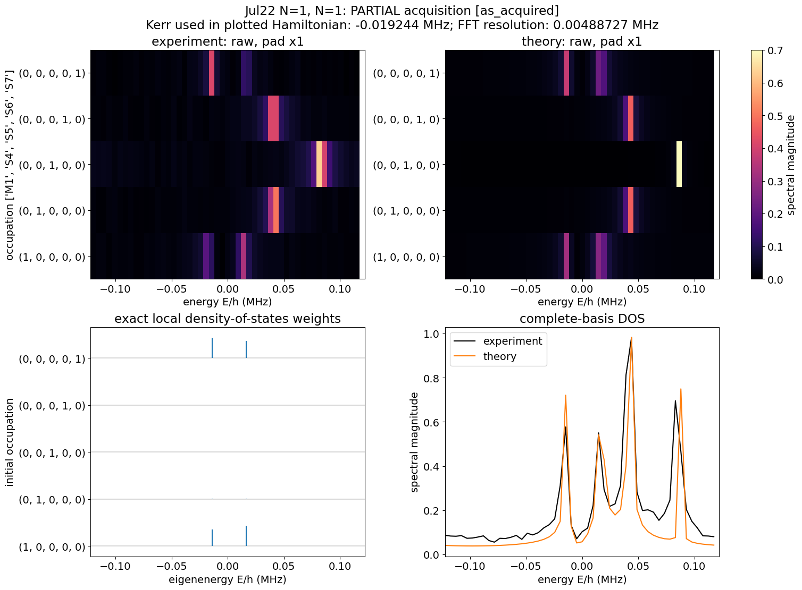

# Job vault (For human)

> **Where the job IDs live now (2026-10-05).** The one master list is
> `configs/datasets/mbr_datasets.yaml` on the `qsim-analysis` branch: one entry per data set with
> the literal job IDs, the folder, the Floquet config, rough g/K labels, and the converted manifest
> under `assembled_data/`. The code reads only that file (`tools/convert_mbr_catalog.py`,
> `tests/mbr_reference.py`). This document keeps the plots and the human-readable description;
> the `h5_job_ids(DATE, START, END)` ranges below are a reading aid, not an identifier (other
> users' jobs interleave in a range). Differences applied in the YAML, from the issue 6 answers:
> `JOB-20260911-00001..28` (stale) and `JOB-20260830-00135` (no phase-90 partner) are dropped,
> the Sep 10-14 set is a *diagonal* complete-basis ensemble (`sep10_full_K3p6_g29p2`, 9
> realizations), and sections 14-16 are kept with `quality: concern`. The companion
> "Only JOB IDs for Agents" file and `docs/job_list_and_nb_labeling/Job_list.md` are retired.

Pasting the python codes, where the syntax is

- h5_project : Folder of the data
- Actual Configs (Format: JOB_{DATE}_{idx between START and END})
    - h5_calibration_job_ids = h5_job_ids(DATE, START, END) (END is included)
    - h5_spectroscopy_job_ids = h5_job_ids(DATE, START, END)
- (if needed) h5_floquet_version: floquet configc file name.
- The FULL JOB id list for calibration and spectroscopy is also pasted below `> extensive list`

# 1. g = 15 kHz, K = 19.2 kHz

## 1. Disordered Full N = 1

- h5_project = '260526_qsim_darkmode’
- h5_calibration_job_ids = h5_job_ids(20260722, 557, 566)
- h5_spectroscopy_job_ids = h5_job_ids(20260722, 577, 595)
- h5_floquet_version = "CFG-FL-20260717-00028”
- extensive list
    
    Spectroscopy job IDs used (10): JOB-20260722-00577, JOB-20260722-00579, JOB-20260722-00581, JOB-20260722-00583, JOB-20260722-00585, JOB-20260722-00587, JOB-20260722-00589, JOB-20260722-00591, JOB-20260722-00593, JOB-20260722-00595
    Calibration job IDs used (10): JOB-20260722-00557, JOB-20260722-00558, JOB-20260722-00559, JOB-20260722-00560, JOB-20260722-00561, JOB-20260722-00562, JOB-20260722-00563, JOB-20260722-00564, JOB-20260722-00565, JOB-20260722-00566
    

## 2. Disorderless Partial N =2

- h5_project = '260526_qsim_darkmode'
- h5_calibration_job_ids = h5_job_ids(20260722, 35, 64)
- h5_spectroscopy_job_ids = h5_job_ids(20260722, 215, 244)
- h5_floquet_version = 'CFG-FL-20260722-00001'
- extensive list
    
    Spectroscopy job IDs used (28): JOB-20260722-00215, JOB-20260722-00216, JOB-20260722-00217, JOB-20260722-00218, JOB-20260722-00219, JOB-20260722-00220, JOB-20260722-00221, JOB-20260722-00222, JOB-20260722-00223, JOB-20260722-00224, JOB-20260722-00225, JOB-20260722-00226, JOB-20260722-00227, JOB-20260722-00228, JOB-20260722-00229, JOB-20260722-00231, JOB-20260722-00232, JOB-20260722-00233, JOB-20260722-00234, JOB-20260722-00235, JOB-20260722-00236, JOB-20260722-00237, JOB-20260722-00238, JOB-20260722-00239, JOB-20260722-00240, JOB-20260722-00241, JOB-20260722-00242, JOB-20260722-00243
    Calibration job IDs used (30): JOB-20260722-00035, JOB-20260722-00036, JOB-20260722-00037, JOB-20260722-00038, JOB-20260722-00039, JOB-20260722-00040, JOB-20260722-00041, JOB-20260722-00042, JOB-20260722-00043, JOB-20260722-00044, JOB-20260722-00045, JOB-20260722-00046, JOB-20260722-00047, JOB-20260722-00048, JOB-20260722-00049, JOB-20260722-00050, JOB-20260722-00051, JOB-20260722-00052, JOB-20260722-00053, JOB-20260722-00054, JOB-20260722-00055, JOB-20260722-00056, JOB-20260722-00057, JOB-20260722-00058, JOB-20260722-00059, JOB-20260722-00060, JOB-20260722-00061, JOB-20260722-00062, JOB-20260722-00063, JOB-20260722-00064
    

## 2-1. Missing One element for N =2

- h5_project = '260526_qsim_darkmode'
- h5_calibration_job_ids = h5_job_ids(20260722, 425, 426)
- h5_spectroscopy_job_ids = h5_job_ids(20260722, 452, 454)
- h5_floquet_version = 'CFG-FL-20260722-00001'
- extensive list
    
    Spectroscopy job IDs used (2): JOB-20260722-00452, JOB-20260722-00454
    Calibration job IDs used (2): JOB-20260722-00425, JOB-20260722-00426
    

## 3. Disorderless Full N = 3

- h5_project = '260526_qsim_darkmode'
- h5_calibration_job_ids = (
h5_job_ids(20260722, 683, 712)
+ h5_job_ids(20260723, 1, 40)
)
- h5_spectroscopy_job_ids = (
h5_job_ids(20260723, 48, 85)
+ h5_job_ids(20260723, 87, 149)
)
- h5_floquet_version = 'CFG-FL-20260722-00001'
- extensive list
    
    Spectroscopy job IDs used (70): JOB-20260723-00048, JOB-20260723-00049, JOB-20260723-00050, JOB-20260723-00051, JOB-20260723-00052, JOB-20260723-00053, JOB-20260723-00054, JOB-20260723-00055, JOB-20260723-00056, JOB-20260723-00057, JOB-20260723-00058, JOB-20260723-00059, JOB-20260723-00060, JOB-20260723-00061, JOB-20260723-00062, JOB-20260723-00063, JOB-20260723-00064, JOB-20260723-00065, JOB-20260723-00066, JOB-20260723-00067, JOB-20260723-00068, JOB-20260723-00069, JOB-20260723-00070, JOB-20260723-00071, JOB-20260723-00072, JOB-20260723-00073, JOB-20260723-00074, JOB-20260723-00075, JOB-20260723-00076, JOB-20260723-00077, JOB-20260723-00078, JOB-20260723-00079, JOB-20260723-00080, JOB-20260723-00081, JOB-20260723-00082, JOB-20260723-00083, JOB-20260723-00084, JOB-20260723-00085, JOB-20260723-00087, JOB-20260723-00089, JOB-20260723-00091, JOB-20260723-00093, JOB-20260723-00095, JOB-20260723-00097, JOB-20260723-00099, JOB-20260723-00101, JOB-20260723-00103, JOB-20260723-00105, JOB-20260723-00107, JOB-20260723-00109, JOB-20260723-00111, JOB-20260723-00113, JOB-20260723-00115, JOB-20260723-00117, JOB-20260723-00119, JOB-20260723-00121, JOB-20260723-00123, JOB-20260723-00125, JOB-20260723-00127, JOB-20260723-00129, JOB-20260723-00131, JOB-20260723-00133, JOB-20260723-00135, JOB-20260723-00137, JOB-20260723-00139, JOB-20260723-00141, JOB-20260723-00143, JOB-20260723-00145, JOB-20260723-00147, JOB-20260723-00149
    Calibration job IDs used (70): JOB-20260722-00683, JOB-20260722-00684, JOB-20260722-00685, JOB-20260722-00686, JOB-20260722-00687, JOB-20260722-00688, JOB-20260722-00689, JOB-20260722-00690, JOB-20260722-00691, JOB-20260722-00692, JOB-20260722-00693, JOB-20260722-00694, JOB-20260722-00695, JOB-20260722-00696, JOB-20260722-00697, JOB-20260722-00698, JOB-20260722-00699, JOB-20260722-00700, JOB-20260722-00701, JOB-20260722-00702, JOB-20260722-00703, JOB-20260722-00704, JOB-20260722-00705, JOB-20260722-00706, JOB-20260722-00707, JOB-20260722-00708, JOB-20260722-00709, JOB-20260722-00710, JOB-20260722-00711, JOB-20260722-00712, JOB-20260723-00001, JOB-20260723-00002, JOB-20260723-00003, JOB-20260723-00004, JOB-20260723-00005, JOB-20260723-00006, JOB-20260723-00007, JOB-20260723-00008, JOB-20260723-00009, JOB-20260723-00010, JOB-20260723-00011, JOB-20260723-00012, JOB-20260723-00013, JOB-20260723-00014, JOB-20260723-00015, JOB-20260723-00016, JOB-20260723-00017, JOB-20260723-00018, JOB-20260723-00019, JOB-20260723-00020, JOB-20260723-00021, JOB-20260723-00022, JOB-20260723-00023, JOB-20260723-00024, JOB-20260723-00025, JOB-20260723-00026, JOB-20260723-00027, JOB-20260723-00028, JOB-20260723-00029, JOB-20260723-00030, JOB-20260723-00031, JOB-20260723-00032, JOB-20260723-00033, JOB-20260723-00034, JOB-20260723-00035, JOB-20260723-00036, JOB-20260723-00037, JOB-20260723-00038, JOB-20260723-00039, JOB-20260723-00040
    

## 4. Disorderless Full N = 1

- h5_project = '260526_qsim_darkmode'
- h5_calibration_job_ids = h5_job_ids(20260721, 423, 432)
- h5_spectroscopy_job_ids = h5_job_ids(20260722, 5, 14)
- h5_floquet_version = "CFG-FL-20260717-00028"
- extensive list
    
    Spectroscopy job IDs used (10): JOB-20260722-00005, JOB-20260722-00006, JOB-20260722-00007, JOB-20260722-00008, JOB-20260722-00009, JOB-20260722-00010, JOB-20260722-00011, JOB-20260722-00012, JOB-20260722-00013, JOB-20260722-00014
    Calibration job IDs used (10): JOB-20260721-00423, JOB-20260721-00424, JOB-20260721-00425, JOB-20260721-00426, JOB-20260721-00427, JOB-20260721-00428, JOB-20260721-00429, JOB-20260721-00430, JOB-20260721-00431, JOB-20260721-00432
    

# 2. g = 8.61 kHz, K = 5.7 kHz

## 1. Disorderless Full N = 3

- h5_project = '260526_qsim_darkmode'
- h5_calibration_job_ids = h5_job_ids(20260815, 113, 182)
- h5_spectroscopy_job_ids = (
h5_job_ids(20260815, 183, 242)
+ h5_job_ids(20260816, 1, 10)
)
- h5_floquet_version = "CFG-FL-20260814-00076"
- extensive list
    
    Spectroscopy job IDs used (70): JOB-20260815-00183, JOB-20260815-00184, JOB-20260815-00185, JOB-20260815-00186, JOB-20260815-00187, JOB-20260815-00188, JOB-20260815-00189, JOB-20260815-00190, JOB-20260815-00191, JOB-20260815-00192, JOB-20260815-00193, JOB-20260815-00194, JOB-20260815-00195, JOB-20260815-00196, JOB-20260815-00197, JOB-20260815-00198, JOB-20260815-00199, JOB-20260815-00200, JOB-20260815-00201, JOB-20260815-00202, JOB-20260815-00203, JOB-20260815-00204, JOB-20260815-00205, JOB-20260815-00206, JOB-20260815-00207, JOB-20260815-00208, JOB-20260815-00209, JOB-20260815-00210, JOB-20260815-00211, JOB-20260815-00212, JOB-20260815-00213, JOB-20260815-00214, JOB-20260815-00215, JOB-20260815-00216, JOB-20260815-00217, JOB-20260815-00218, JOB-20260815-00219, JOB-20260815-00220, JOB-20260815-00221, JOB-20260815-00222, JOB-20260815-00223, JOB-20260815-00224, JOB-20260815-00225, JOB-20260815-00226, JOB-20260815-00227, JOB-20260815-00228, JOB-20260815-00229, JOB-20260815-00230, JOB-20260815-00231, JOB-20260815-00232, JOB-20260815-00233, JOB-20260815-00234, JOB-20260815-00235, JOB-20260815-00236, JOB-20260815-00237, JOB-20260815-00238, JOB-20260815-00239, JOB-20260815-00240, JOB-20260815-00241, JOB-20260815-00242, JOB-20260816-00001, JOB-20260816-00002, JOB-20260816-00003, JOB-20260816-00004, JOB-20260816-00005, JOB-20260816-00006, JOB-20260816-00007, JOB-20260816-00008, JOB-20260816-00009, JOB-20260816-00010
    Calibration job IDs used (70): JOB-20260815-00113, JOB-20260815-00114, JOB-20260815-00115, JOB-20260815-00116, JOB-20260815-00117, JOB-20260815-00118, JOB-20260815-00119, JOB-20260815-00120, JOB-20260815-00121, JOB-20260815-00122, JOB-20260815-00123, JOB-20260815-00124, JOB-20260815-00125, JOB-20260815-00126, JOB-20260815-00127, JOB-20260815-00128, JOB-20260815-00129, JOB-20260815-00130, JOB-20260815-00131, JOB-20260815-00132, JOB-20260815-00133, JOB-20260815-00134, JOB-20260815-00135, JOB-20260815-00136, JOB-20260815-00137, JOB-20260815-00138, JOB-20260815-00139, JOB-20260815-00140, JOB-20260815-00141, JOB-20260815-00142, JOB-20260815-00143, JOB-20260815-00144, JOB-20260815-00145, JOB-20260815-00146, JOB-20260815-00147, JOB-20260815-00148, JOB-20260815-00149, JOB-20260815-00150, JOB-20260815-00151, JOB-20260815-00152, JOB-20260815-00153, JOB-20260815-00154, JOB-20260815-00155, JOB-20260815-00156, JOB-20260815-00157, JOB-20260815-00158, JOB-20260815-00159, JOB-20260815-00160, JOB-20260815-00161, JOB-20260815-00162, JOB-20260815-00163, JOB-20260815-00164, JOB-20260815-00165, JOB-20260815-00166, JOB-20260815-00167, JOB-20260815-00168, JOB-20260815-00169, JOB-20260815-00170, JOB-20260815-00171, JOB-20260815-00172, JOB-20260815-00173, JOB-20260815-00174, JOB-20260815-00175, JOB-20260815-00176, JOB-20260815-00177, JOB-20260815-00178, JOB-20260815-00179, JOB-20260815-00180, JOB-20260815-00181, JOB-20260815-00182
    

## 2. Disordered Partial N = 3

- h5_project = '260526_qsim_darkmode'
- h5_calibration_job_ids = h5_job_ids(20260815, 113, 182)
- h5_spectroscopy_job_ids_by_r = {
0: h5_job_ids(20260816, 13, 32),
1: h5_job_ids(20260816, 33, 52),
2: h5_job_ids(20260816, 53, 72),
3: h5_job_ids(20260817, 1, 20),
}
- h5_floquet_version = 'CFG-FL-20260814-00076'
- extensive list
    
    h5_calibration_job_ids = ['JOB-20260815-00113', 'JOB-20260815-00114', 'JOB-20260815-00115', 'JOB-20260815-00116', 'JOB-20260815-00117', 'JOB-20260815-00118', 'JOB-20260815-00119', 'JOB-20260815-00120', 'JOB-20260815-00121', 'JOB-20260815-00122', 'JOB-20260815-00123', 'JOB-20260815-00124', 'JOB-20260815-00125', 'JOB-20260815-00126', 'JOB-20260815-00127', 'JOB-20260815-00128', 'JOB-20260815-00129', 'JOB-20260815-00130', 'JOB-20260815-00131', 'JOB-20260815-00132', 'JOB-20260815-00133', 'JOB-20260815-00134', 'JOB-20260815-00135', 'JOB-20260815-00136', 'JOB-20260815-00137', 'JOB-20260815-00138', 'JOB-20260815-00139', 'JOB-20260815-00140', 'JOB-20260815-00141', 'JOB-20260815-00142', 'JOB-20260815-00143', 'JOB-20260815-00144', 'JOB-20260815-00145', 'JOB-20260815-00146', 'JOB-20260815-00147', 'JOB-20260815-00148', 'JOB-20260815-00149', 'JOB-20260815-00150', 'JOB-20260815-00151', 'JOB-20260815-00152', 'JOB-20260815-00153', 'JOB-20260815-00154', 'JOB-20260815-00155', 'JOB-20260815-00156', 'JOB-20260815-00157', 'JOB-20260815-00158', 'JOB-20260815-00159', 'JOB-20260815-00160', 'JOB-20260815-00161', 'JOB-20260815-00162', 'JOB-20260815-00163', 'JOB-20260815-00164', 'JOB-20260815-00165', 'JOB-20260815-00166', 'JOB-20260815-00167', 'JOB-20260815-00168', 'JOB-20260815-00169', 'JOB-20260815-00170', 'JOB-20260815-00171', 'JOB-20260815-00172', 'JOB-20260815-00173', 'JOB-20260815-00174', 'JOB-20260815-00175', 'JOB-20260815-00176', 'JOB-20260815-00177', 'JOB-20260815-00178', 'JOB-20260815-00179', 'JOB-20260815-00180', 'JOB-20260815-00181', 'JOB-20260815-00182']
    h5_spectroscopy_job_ids_by_r = {
        0: ['JOB-20260816-00013', 'JOB-20260816-00014', 'JOB-20260816-00015', 'JOB-20260816-00016', 'JOB-20260816-00017', 'JOB-20260816-00018', 'JOB-20260816-00019', 'JOB-20260816-00020', 'JOB-20260816-00021', 'JOB-20260816-00022', 'JOB-20260816-00023', 'JOB-20260816-00024', 'JOB-20260816-00025', 'JOB-20260816-00026', 'JOB-20260816-00027', 'JOB-20260816-00028', 'JOB-20260816-00029', 'JOB-20260816-00030', 'JOB-20260816-00031', 'JOB-20260816-00032'],
        1: ['JOB-20260816-00033', 'JOB-20260816-00034', 'JOB-20260816-00035', 'JOB-20260816-00036', 'JOB-20260816-00037', 'JOB-20260816-00038', 'JOB-20260816-00039', 'JOB-20260816-00040', 'JOB-20260816-00041', 'JOB-20260816-00042', 'JOB-20260816-00043', 'JOB-20260816-00044', 'JOB-20260816-00045', 'JOB-20260816-00046', 'JOB-20260816-00047', 'JOB-20260816-00048', 'JOB-20260816-00049', 'JOB-20260816-00050', 'JOB-20260816-00051', 'JOB-20260816-00052'],
        2: ['JOB-20260816-00053', 'JOB-20260816-00054', 'JOB-20260816-00055', 'JOB-20260816-00056', 'JOB-20260816-00057', 'JOB-20260816-00058', 'JOB-20260816-00059', 'JOB-20260816-00060', 'JOB-20260816-00061', 'JOB-20260816-00062', 'JOB-20260816-00063', 'JOB-20260816-00064', 'JOB-20260816-00065', 'JOB-20260816-00066', 'JOB-20260816-00067', 'JOB-20260816-00068', 'JOB-20260816-00069', 'JOB-20260816-00070', 'JOB-20260816-00071', 'JOB-20260816-00072'],
        3: ['JOB-20260817-00001', 'JOB-20260817-00002', 'JOB-20260817-00003', 'JOB-20260817-00004', 'JOB-20260817-00005', 'JOB-20260817-00006', 'JOB-20260817-00007', 'JOB-20260817-00008', 'JOB-20260817-00009', 'JOB-20260817-00010', 'JOB-20260817-00011', 'JOB-20260817-00012', 'JOB-20260817-00013', 'JOB-20260817-00014', 'JOB-20260817-00015', 'JOB-20260817-00016', 'JOB-20260817-00017', 'JOB-20260817-00018', 'JOB-20260817-00019', 'JOB-20260817-00020'],
    }
    

# 3. g = 15.2 kHz, K = 44.96 kHz

## 1. Disordered Partial N = 3

- h5_project = '260818_qsim_spectroscopy'
- h5_calibration_job_ids = h5_job_ids(20260828, 289, 358)
- h5_spectroscopy_job_ids_by_r = {
0: h5_job_ids(20260829, 16, 35),
1: h5_job_ids(20260829, 36, 55),
2: h5_job_ids(20260829, 56, 75),
3: h5_job_ids(20260829, 76, 95),
4: h5_job_ids(20260829, 96, 115),
5: h5_job_ids(20260829, 116, 135),
6: h5_job_ids(20260829, 136, 155),
7: h5_job_ids(20260829, 156, 175),
8: h5_job_ids(20260829, 176, 195),
9: h5_job_ids(20260829, 196, 215),
10: h5_job_ids(20260829, 216, 235),
11: h5_job_ids(20260829, 236, 255),
12: h5_job_ids(20260829, 256, 271) + h5_job_ids(20260830, 1, 4),
13: h5_job_ids(20260830, 5, 24),
14: h5_job_ids(20260830, 25, 44),
15: h5_job_ids(20260830, 45, 64),
16: h5_job_ids(20260830, 65, 84),
17: h5_job_ids(20260830, 85, 104),
18: h5_job_ids(20260830, 105, 124),
19: h5_job_ids(20260830, 125, 135),
}
- h5_floquet_version = 'CFG-FL-20260825-00097'
- extensive list
    
    h5_calibration_job_ids = ['JOB-20260828-00289', 'JOB-20260828-00290', 'JOB-20260828-00291', 'JOB-20260828-00292', 'JOB-20260828-00293', 'JOB-20260828-00294', 'JOB-20260828-00295', 'JOB-20260828-00296', 'JOB-20260828-00297', 'JOB-20260828-00298', 'JOB-20260828-00299', 'JOB-20260828-00300', 'JOB-20260828-00301', 'JOB-20260828-00302', 'JOB-20260828-00303', 'JOB-20260828-00304', 'JOB-20260828-00305', 'JOB-20260828-00306', 'JOB-20260828-00307', 'JOB-20260828-00308', 'JOB-20260828-00309', 'JOB-20260828-00310', 'JOB-20260828-00311', 'JOB-20260828-00312', 'JOB-20260828-00313', 'JOB-20260828-00314', 'JOB-20260828-00315', 'JOB-20260828-00316', 'JOB-20260828-00317', 'JOB-20260828-00318', 'JOB-20260828-00319', 'JOB-20260828-00320', 'JOB-20260828-00321', 'JOB-20260828-00322', 'JOB-20260828-00323', 'JOB-20260828-00324', 'JOB-20260828-00325', 'JOB-20260828-00326', 'JOB-20260828-00327', 'JOB-20260828-00328', 'JOB-20260828-00329', 'JOB-20260828-00330', 'JOB-20260828-00331', 'JOB-20260828-00332', 'JOB-20260828-00333', 'JOB-20260828-00334', 'JOB-20260828-00335', 'JOB-20260828-00336', 'JOB-20260828-00337', 'JOB-20260828-00338', 'JOB-20260828-00339', 'JOB-20260828-00340', 'JOB-20260828-00341', 'JOB-20260828-00342', 'JOB-20260828-00343', 'JOB-20260828-00344', 'JOB-20260828-00345', 'JOB-20260828-00346', 'JOB-20260828-00347', 'JOB-20260828-00348', 'JOB-20260828-00349', 'JOB-20260828-00350', 'JOB-20260828-00351', 'JOB-20260828-00352', 'JOB-20260828-00353', 'JOB-20260828-00354', 'JOB-20260828-00355', 'JOB-20260828-00356', 'JOB-20260828-00357', 'JOB-20260828-00358']
    h5_spectroscopy_job_ids_by_r = {
    0: ['JOB-20260829-00016', 'JOB-20260829-00017', 'JOB-20260829-00018', 'JOB-20260829-00019', 'JOB-20260829-00020', 'JOB-20260829-00021', 'JOB-20260829-00022', 'JOB-20260829-00023', 'JOB-20260829-00024', 'JOB-20260829-00025', 'JOB-20260829-00026', 'JOB-20260829-00027', 'JOB-20260829-00028', 'JOB-20260829-00029', 'JOB-20260829-00030', 'JOB-20260829-00031', 'JOB-20260829-00032', 'JOB-20260829-00033', 'JOB-20260829-00034', 'JOB-20260829-00035'],
    1: ['JOB-20260829-00036', 'JOB-20260829-00037', 'JOB-20260829-00038', 'JOB-20260829-00039', 'JOB-20260829-00040', 'JOB-20260829-00041', 'JOB-20260829-00042', 'JOB-20260829-00043', 'JOB-20260829-00044', 'JOB-20260829-00045', 'JOB-20260829-00046', 'JOB-20260829-00047', 'JOB-20260829-00048', 'JOB-20260829-00049', 'JOB-20260829-00050', 'JOB-20260829-00051', 'JOB-20260829-00052', 'JOB-20260829-00053', 'JOB-20260829-00054', 'JOB-20260829-00055'],
    2: ['JOB-20260829-00056', 'JOB-20260829-00057', 'JOB-20260829-00058', 'JOB-20260829-00059', 'JOB-20260829-00060', 'JOB-20260829-00061', 'JOB-20260829-00062', 'JOB-20260829-00063', 'JOB-20260829-00064', 'JOB-20260829-00065', 'JOB-20260829-00066', 'JOB-20260829-00067', 'JOB-20260829-00068', 'JOB-20260829-00069', 'JOB-20260829-00070', 'JOB-20260829-00071', 'JOB-20260829-00072', 'JOB-20260829-00073', 'JOB-20260829-00074', 'JOB-20260829-00075'],
    3: ['JOB-20260829-00076', 'JOB-20260829-00077', 'JOB-20260829-00078', 'JOB-20260829-00079', 'JOB-20260829-00080', 'JOB-20260829-00081', 'JOB-20260829-00082', 'JOB-20260829-00083', 'JOB-20260829-00084', 'JOB-20260829-00085', 'JOB-20260829-00086', 'JOB-20260829-00087', 'JOB-20260829-00088', 'JOB-20260829-00089', 'JOB-20260829-00090', 'JOB-20260829-00091', 'JOB-20260829-00092', 'JOB-20260829-00093', 'JOB-20260829-00094', 'JOB-20260829-00095'],
    4: ['JOB-20260829-00096', 'JOB-20260829-00097', 'JOB-20260829-00098', 'JOB-20260829-00099', 'JOB-20260829-00100', 'JOB-20260829-00101', 'JOB-20260829-00102', 'JOB-20260829-00103', 'JOB-20260829-00104', 'JOB-20260829-00105', 'JOB-20260829-00106', 'JOB-20260829-00107', 'JOB-20260829-00108', 'JOB-20260829-00109', 'JOB-20260829-00110', 'JOB-20260829-00111', 'JOB-20260829-00112', 'JOB-20260829-00113', 'JOB-20260829-00114', 'JOB-20260829-00115'],
    5: ['JOB-20260829-00116', 'JOB-20260829-00117', 'JOB-20260829-00118', 'JOB-20260829-00119', 'JOB-20260829-00120', 'JOB-20260829-00121', 'JOB-20260829-00122', 'JOB-20260829-00123', 'JOB-20260829-00124', 'JOB-20260829-00125', 'JOB-20260829-00126', 'JOB-20260829-00127', 'JOB-20260829-00128', 'JOB-20260829-00129', 'JOB-20260829-00130', 'JOB-20260829-00131', 'JOB-20260829-00132', 'JOB-20260829-00133', 'JOB-20260829-00134', 'JOB-20260829-00135'],
    6: ['JOB-20260829-00136', 'JOB-20260829-00137', 'JOB-20260829-00138', 'JOB-20260829-00139', 'JOB-20260829-00140', 'JOB-20260829-00141', 'JOB-20260829-00142', 'JOB-20260829-00143', 'JOB-20260829-00144', 'JOB-20260829-00145', 'JOB-20260829-00146', 'JOB-20260829-00147', 'JOB-20260829-00148', 'JOB-20260829-00149', 'JOB-20260829-00150', 'JOB-20260829-00151', 'JOB-20260829-00152', 'JOB-20260829-00153', 'JOB-20260829-00154', 'JOB-20260829-00155'],
    7: ['JOB-20260829-00156', 'JOB-20260829-00157', 'JOB-20260829-00158', 'JOB-20260829-00159', 'JOB-20260829-00160', 'JOB-20260829-00161', 'JOB-20260829-00162', 'JOB-20260829-00163', 'JOB-20260829-00164', 'JOB-20260829-00165', 'JOB-20260829-00166', 'JOB-20260829-00167', 'JOB-20260829-00168', 'JOB-20260829-00169', 'JOB-20260829-00170', 'JOB-20260829-00171', 'JOB-20260829-00172', 'JOB-20260829-00173', 'JOB-20260829-00174', 'JOB-20260829-00175'],
    8: ['JOB-20260829-00176', 'JOB-20260829-00177', 'JOB-20260829-00178', 'JOB-20260829-00179', 'JOB-20260829-00180', 'JOB-20260829-00181', 'JOB-20260829-00182', 'JOB-20260829-00183', 'JOB-20260829-00184', 'JOB-20260829-00185', 'JOB-20260829-00186', 'JOB-20260829-00187', 'JOB-20260829-00188', 'JOB-20260829-00189', 'JOB-20260829-00190', 'JOB-20260829-00191', 'JOB-20260829-00192', 'JOB-20260829-00193', 'JOB-20260829-00194', 'JOB-20260829-00195'],
    9: ['JOB-20260829-00196', 'JOB-20260829-00197', 'JOB-20260829-00198', 'JOB-20260829-00199', 'JOB-20260829-00200', 'JOB-20260829-00201', 'JOB-20260829-00202', 'JOB-20260829-00203', 'JOB-20260829-00204', 'JOB-20260829-00205', 'JOB-20260829-00206', 'JOB-20260829-00207', 'JOB-20260829-00208', 'JOB-20260829-00209', 'JOB-20260829-00210', 'JOB-20260829-00211', 'JOB-20260829-00212', 'JOB-20260829-00213', 'JOB-20260829-00214', 'JOB-20260829-00215'],
    10: ['JOB-20260829-00216', 'JOB-20260829-00217', 'JOB-20260829-00218', 'JOB-20260829-00219', 'JOB-20260829-00220', 'JOB-20260829-00221', 'JOB-20260829-00222', 'JOB-20260829-00223', 'JOB-20260829-00224', 'JOB-20260829-00225', 'JOB-20260829-00226', 'JOB-20260829-00227', 'JOB-20260829-00228', 'JOB-20260829-00229', 'JOB-20260829-00230', 'JOB-20260829-00231', 'JOB-20260829-00232', 'JOB-20260829-00233', 'JOB-20260829-00234', 'JOB-20260829-00235'],
    11: ['JOB-20260829-00236', 'JOB-20260829-00237', 'JOB-20260829-00238', 'JOB-20260829-00239', 'JOB-20260829-00240', 'JOB-20260829-00241', 'JOB-20260829-00242', 'JOB-20260829-00243', 'JOB-20260829-00244', 'JOB-20260829-00245', 'JOB-20260829-00246', 'JOB-20260829-00247', 'JOB-20260829-00248', 'JOB-20260829-00249', 'JOB-20260829-00250', 'JOB-20260829-00251', 'JOB-20260829-00252', 'JOB-20260829-00253', 'JOB-20260829-00254', 'JOB-20260829-00255'],
    12: ['JOB-20260829-00256', 'JOB-20260829-00257', 'JOB-20260829-00258', 'JOB-20260829-00259', 'JOB-20260829-00260', 'JOB-20260829-00261', 'JOB-20260829-00262', 'JOB-20260829-00263', 'JOB-20260829-00264', 'JOB-20260829-00265', 'JOB-20260829-00266', 'JOB-20260829-00267', 'JOB-20260829-00268', 'JOB-20260829-00269', 'JOB-20260829-00270', 'JOB-20260829-00271', 'JOB-20260830-00001', 'JOB-20260830-00002', 'JOB-20260830-00003', 'JOB-20260830-00004'],
    13: ['JOB-20260830-00005', 'JOB-20260830-00006', 'JOB-20260830-00007', 'JOB-20260830-00008', 'JOB-20260830-00009', 'JOB-20260830-00010', 'JOB-20260830-00011', 'JOB-20260830-00012', 'JOB-20260830-00013', 'JOB-20260830-00014', 'JOB-20260830-00015', 'JOB-20260830-00016', 'JOB-20260830-00017', 'JOB-20260830-00018', 'JOB-20260830-00019', 'JOB-20260830-00020', 'JOB-20260830-00021', 'JOB-20260830-00022', 'JOB-20260830-00023', 'JOB-20260830-00024'],
    14: ['JOB-20260830-00025', 'JOB-20260830-00026', 'JOB-20260830-00027', 'JOB-20260830-00028', 'JOB-20260830-00029', 'JOB-20260830-00030', 'JOB-20260830-00031', 'JOB-20260830-00032', 'JOB-20260830-00033', 'JOB-20260830-00034', 'JOB-20260830-00035', 'JOB-20260830-00036', 'JOB-20260830-00037', 'JOB-20260830-00038', 'JOB-20260830-00039', 'JOB-20260830-00040', 'JOB-20260830-00041', 'JOB-20260830-00042', 'JOB-20260830-00043', 'JOB-20260830-00044'],
    15: ['JOB-20260830-00045', 'JOB-20260830-00046', 'JOB-20260830-00047', 'JOB-20260830-00048', 'JOB-20260830-00049', 'JOB-20260830-00050', 'JOB-20260830-00051', 'JOB-20260830-00052', 'JOB-20260830-00053', 'JOB-20260830-00054', 'JOB-20260830-00055', 'JOB-20260830-00056', 'JOB-20260830-00057', 'JOB-20260830-00058', 'JOB-20260830-00059', 'JOB-20260830-00060', 'JOB-20260830-00061', 'JOB-20260830-00062', 'JOB-20260830-00063', 'JOB-20260830-00064'],
    16: ['JOB-20260830-00065', 'JOB-20260830-00066', 'JOB-20260830-00067', 'JOB-20260830-00068', 'JOB-20260830-00069', 'JOB-20260830-00070', 'JOB-20260830-00071', 'JOB-20260830-00072', 'JOB-20260830-00073', 'JOB-20260830-00074', 'JOB-20260830-00075', 'JOB-20260830-00076', 'JOB-20260830-00077', 'JOB-20260830-00078', 'JOB-20260830-00079', 'JOB-20260830-00080', 'JOB-20260830-00081', 'JOB-20260830-00082', 'JOB-20260830-00083', 'JOB-20260830-00084'],
    17: ['JOB-20260830-00085', 'JOB-20260830-00086', 'JOB-20260830-00087', 'JOB-20260830-00088', 'JOB-20260830-00089', 'JOB-20260830-00090', 'JOB-20260830-00091', 'JOB-20260830-00092', 'JOB-20260830-00093', 'JOB-20260830-00094', 'JOB-20260830-00095', 'JOB-20260830-00096', 'JOB-20260830-00097', 'JOB-20260830-00098', 'JOB-20260830-00099', 'JOB-20260830-00100', 'JOB-20260830-00101', 'JOB-20260830-00102', 'JOB-20260830-00103', 'JOB-20260830-00104'],
    18: ['JOB-20260830-00105', 'JOB-20260830-00106', 'JOB-20260830-00107', 'JOB-20260830-00108', 'JOB-20260830-00109', 'JOB-20260830-00110', 'JOB-20260830-00111', 'JOB-20260830-00112', 'JOB-20260830-00113', 'JOB-20260830-00114', 'JOB-20260830-00115', 'JOB-20260830-00116', 'JOB-20260830-00117', 'JOB-20260830-00118', 'JOB-20260830-00119', 'JOB-20260830-00120', 'JOB-20260830-00121', 'JOB-20260830-00122', 'JOB-20260830-00123', 'JOB-20260830-00124'],
    19: ['JOB-20260830-00125', 'JOB-20260830-00126', 'JOB-20260830-00127', 'JOB-20260830-00128', 'JOB-20260830-00129', 'JOB-20260830-00130', 'JOB-20260830-00131', 'JOB-20260830-00132', 'JOB-20260830-00133', 'JOB-20260830-00134'],
    }
    

## 2. Disorderless Full N = 1

- h5_project = '260818_qsim_spectroscopy'
- h5_calibration_job_ids = h5_job_ids(20260828, 396, 405)
- h5_spectroscopy_job_ids = h5_job_ids(20260828, 427, 436)
- h5_floquet_version = "CFG-FL-20260828-00122"
- extensive list
    
    Spectroscopy job IDs used (10): JOB-20260828-00427, JOB-20260828-00428, JOB-20260828-00429, JOB-20260828-00430, JOB-20260828-00431, JOB-20260828-00432, JOB-20260828-00433, JOB-20260828-00434, JOB-20260828-00435, JOB-20260828-00436
    Calibration job IDs used (10): JOB-20260828-00396, JOB-20260828-00397, JOB-20260828-00398, JOB-20260828-00399, JOB-20260828-00400, JOB-20260828-00401, JOB-20260828-00402, JOB-20260828-00403, JOB-20260828-00404, JOB-20260828-00405
    

# 4. g = 29.2 kHz, K = 3.6 kHz

## 1. Disordered Full N = 3

- h5_project = '260818_qsim_spectroscopy'
- h5_calibration_job_ids = h5_job_ids(20260909, 152, 211) + h5_job_ids(20260910, 1, 10)
- h5_spectroscopy_job_ids_by_r = {
0: h5_job_ids(20260910, 31, 72) + h5_job_ids(20260911, 46, 87),
1: h5_job_ids(20260912, 33, 136),
2: h5_job_ids(20260912, 137, 241),
3: h5_job_ids(20260912, 243, 347),
4: h5_job_ids(20260912, 348, 419) + h5_job_ids(20260913, 1, 64),
5: h5_job_ids(20260913, 65, 168),
6: h5_job_ids(20260913, 169, 273),
7: h5_job_ids(20260913, 274, 378),
8: h5_job_ids(20260913, 380, 399) + h5_job_ids(20260914, 1, 84),
}
- h5_floquet_version = 'CFG-FL-20260909-00042'
- extensive list
    
    h5_calibration_job_ids = ['JOB-20260909-00152', 'JOB-20260909-00153', 'JOB-20260909-00154', 'JOB-20260909-00155', 'JOB-20260909-00156', 'JOB-20260909-00157', 'JOB-20260909-00158', 'JOB-20260909-00159', 'JOB-20260909-00160', 'JOB-20260909-00161', 'JOB-20260909-00162', 'JOB-20260909-00163', 'JOB-20260909-00164', 'JOB-20260909-00165', 'JOB-20260909-00166', 'JOB-20260909-00167', 'JOB-20260909-00168', 'JOB-20260909-00169', 'JOB-20260909-00170', 'JOB-20260909-00171', 'JOB-20260909-00172', 'JOB-20260909-00173', 'JOB-20260909-00174', 'JOB-20260909-00175', 'JOB-20260909-00176', 'JOB-20260909-00177', 'JOB-20260909-00178', 'JOB-20260909-00179', 'JOB-20260909-00180', 'JOB-20260909-00181', 'JOB-20260909-00182', 'JOB-20260909-00183', 'JOB-20260909-00184', 'JOB-20260909-00185', 'JOB-20260909-00186', 'JOB-20260909-00187', 'JOB-20260909-00188', 'JOB-20260909-00189', 'JOB-20260909-00190', 'JOB-20260909-00191', 'JOB-20260909-00192', 'JOB-20260909-00193', 'JOB-20260909-00194', 'JOB-20260909-00195', 'JOB-20260909-00196', 'JOB-20260909-00197', 'JOB-20260909-00198', 'JOB-20260909-00199', 'JOB-20260909-00200', 'JOB-20260909-00201', 'JOB-20260909-00202', 'JOB-20260909-00203', 'JOB-20260909-00204', 'JOB-20260909-00205', 'JOB-20260909-00206', 'JOB-20260909-00207', 'JOB-20260909-00208', 'JOB-20260909-00209', 'JOB-20260909-00210', 'JOB-20260909-00211', 'JOB-20260910-00001', 'JOB-20260910-00002', 'JOB-20260910-00003', 'JOB-20260910-00004', 'JOB-20260910-00005', 'JOB-20260910-00006', 'JOB-20260910-00007', 'JOB-20260910-00008', 'JOB-20260910-00009', 'JOB-20260910-00010']
    h5_spectroscopy_job_ids_by_r = {
    0: ['JOB-20260910-00031', 'JOB-20260910-00032', 'JOB-20260910-00033', 'JOB-20260910-00034', 'JOB-20260910-00035', 'JOB-20260910-00036', 'JOB-20260910-00037', 'JOB-20260910-00038', 'JOB-20260910-00039', 'JOB-20260910-00040', 'JOB-20260910-00041', 'JOB-20260910-00042', 'JOB-20260910-00043', 'JOB-20260910-00044', 'JOB-20260910-00045', 'JOB-20260910-00046', 'JOB-20260910-00047', 'JOB-20260910-00048', 'JOB-20260910-00049', 'JOB-20260910-00050', 'JOB-20260910-00051', 'JOB-20260910-00052', 'JOB-20260910-00053', 'JOB-20260910-00054', 'JOB-20260910-00055', 'JOB-20260910-00056', 'JOB-20260910-00057', 'JOB-20260910-00058', 'JOB-20260910-00059', 'JOB-20260910-00060', 'JOB-20260910-00061', 'JOB-20260910-00062', 'JOB-20260910-00063', 'JOB-20260910-00064', 'JOB-20260910-00065', 'JOB-20260910-00066', 'JOB-20260910-00067', 'JOB-20260910-00068', 'JOB-20260910-00069', 'JOB-20260910-00070', 'JOB-20260910-00071', 'JOB-20260910-00072', 'JOB-20260911-00046', 'JOB-20260911-00047', 'JOB-20260911-00049', 'JOB-20260911-00050', 'JOB-20260911-00052', 'JOB-20260911-00053', 'JOB-20260911-00055', 'JOB-20260911-00056', 'JOB-20260911-00058', 'JOB-20260911-00059', 'JOB-20260911-00061', 'JOB-20260911-00062', 'JOB-20260911-00064', 'JOB-20260911-00065', 'JOB-20260911-00067', 'JOB-20260911-00068', 'JOB-20260911-00070', 'JOB-20260911-00071', 'JOB-20260911-00073', 'JOB-20260911-00074', 'JOB-20260911-00076', 'JOB-20260911-00077', 'JOB-20260911-00079', 'JOB-20260911-00080', 'JOB-20260911-00082', 'JOB-20260911-00083', 'JOB-20260911-00085', 'JOB-20260911-00086'],
    1: ['JOB-20260912-00033', 'JOB-20260912-00034', 'JOB-20260912-00036', 'JOB-20260912-00037', 'JOB-20260912-00039', 'JOB-20260912-00040', 'JOB-20260912-00042', 'JOB-20260912-00043', 'JOB-20260912-00045', 'JOB-20260912-00046', 'JOB-20260912-00048', 'JOB-20260912-00049', 'JOB-20260912-00051', 'JOB-20260912-00052', 'JOB-20260912-00054', 'JOB-20260912-00055', 'JOB-20260912-00057', 'JOB-20260912-00058', 'JOB-20260912-00060', 'JOB-20260912-00061', 'JOB-20260912-00063', 'JOB-20260912-00064', 'JOB-20260912-00066', 'JOB-20260912-00067', 'JOB-20260912-00069', 'JOB-20260912-00070', 'JOB-20260912-00072', 'JOB-20260912-00073', 'JOB-20260912-00075', 'JOB-20260912-00076', 'JOB-20260912-00078', 'JOB-20260912-00079', 'JOB-20260912-00081', 'JOB-20260912-00082', 'JOB-20260912-00084', 'JOB-20260912-00085', 'JOB-20260912-00087', 'JOB-20260912-00088', 'JOB-20260912-00090', 'JOB-20260912-00091', 'JOB-20260912-00093', 'JOB-20260912-00094', 'JOB-20260912-00096', 'JOB-20260912-00097', 'JOB-20260912-00099', 'JOB-20260912-00100', 'JOB-20260912-00102', 'JOB-20260912-00103', 'JOB-20260912-00105', 'JOB-20260912-00106', 'JOB-20260912-00108', 'JOB-20260912-00109', 'JOB-20260912-00111', 'JOB-20260912-00112', 'JOB-20260912-00114', 'JOB-20260912-00115', 'JOB-20260912-00117', 'JOB-20260912-00118', 'JOB-20260912-00120', 'JOB-20260912-00121', 'JOB-20260912-00123', 'JOB-20260912-00124', 'JOB-20260912-00126', 'JOB-20260912-00127', 'JOB-20260912-00129', 'JOB-20260912-00130', 'JOB-20260912-00132', 'JOB-20260912-00133', 'JOB-20260912-00135', 'JOB-20260912-00136'],
    2: ['JOB-20260912-00138', 'JOB-20260912-00139', 'JOB-20260912-00141', 'JOB-20260912-00142', 'JOB-20260912-00144', 'JOB-20260912-00145', 'JOB-20260912-00147', 'JOB-20260912-00148', 'JOB-20260912-00150', 'JOB-20260912-00151', 'JOB-20260912-00153', 'JOB-20260912-00154', 'JOB-20260912-00156', 'JOB-20260912-00157', 'JOB-20260912-00159', 'JOB-20260912-00160', 'JOB-20260912-00162', 'JOB-20260912-00163', 'JOB-20260912-00165', 'JOB-20260912-00166', 'JOB-20260912-00168', 'JOB-20260912-00169', 'JOB-20260912-00171', 'JOB-20260912-00172', 'JOB-20260912-00174', 'JOB-20260912-00175', 'JOB-20260912-00177', 'JOB-20260912-00178', 'JOB-20260912-00180', 'JOB-20260912-00181', 'JOB-20260912-00183', 'JOB-20260912-00184', 'JOB-20260912-00186', 'JOB-20260912-00187', 'JOB-20260912-00189', 'JOB-20260912-00190', 'JOB-20260912-00192', 'JOB-20260912-00193', 'JOB-20260912-00195', 'JOB-20260912-00196', 'JOB-20260912-00198', 'JOB-20260912-00199', 'JOB-20260912-00201', 'JOB-20260912-00202', 'JOB-20260912-00204', 'JOB-20260912-00205', 'JOB-20260912-00207', 'JOB-20260912-00208', 'JOB-20260912-00210', 'JOB-20260912-00211', 'JOB-20260912-00213', 'JOB-20260912-00214', 'JOB-20260912-00216', 'JOB-20260912-00217', 'JOB-20260912-00219', 'JOB-20260912-00220', 'JOB-20260912-00222', 'JOB-20260912-00223', 'JOB-20260912-00225', 'JOB-20260912-00226', 'JOB-20260912-00228', 'JOB-20260912-00229', 'JOB-20260912-00231', 'JOB-20260912-00232', 'JOB-20260912-00234', 'JOB-20260912-00235', 'JOB-20260912-00237', 'JOB-20260912-00238', 'JOB-20260912-00240', 'JOB-20260912-00241'],
    3: ['JOB-20260912-00243', 'JOB-20260912-00244', 'JOB-20260912-00246', 'JOB-20260912-00247', 'JOB-20260912-00249', 'JOB-20260912-00250', 'JOB-20260912-00252', 'JOB-20260912-00253', 'JOB-20260912-00255', 'JOB-20260912-00256', 'JOB-20260912-00258', 'JOB-20260912-00259', 'JOB-20260912-00261', 'JOB-20260912-00262', 'JOB-20260912-00264', 'JOB-20260912-00265', 'JOB-20260912-00267', 'JOB-20260912-00268', 'JOB-20260912-00270', 'JOB-20260912-00271', 'JOB-20260912-00273', 'JOB-20260912-00274', 'JOB-20260912-00276', 'JOB-20260912-00277', 'JOB-20260912-00279', 'JOB-20260912-00280', 'JOB-20260912-00282', 'JOB-20260912-00283', 'JOB-20260912-00285', 'JOB-20260912-00286', 'JOB-20260912-00288', 'JOB-20260912-00289', 'JOB-20260912-00291', 'JOB-20260912-00292', 'JOB-20260912-00294', 'JOB-20260912-00295', 'JOB-20260912-00297', 'JOB-20260912-00298', 'JOB-20260912-00300', 'JOB-20260912-00301', 'JOB-20260912-00303', 'JOB-20260912-00304', 'JOB-20260912-00306', 'JOB-20260912-00307', 'JOB-20260912-00309', 'JOB-20260912-00310', 'JOB-20260912-00312', 'JOB-20260912-00313', 'JOB-20260912-00315', 'JOB-20260912-00316', 'JOB-20260912-00318', 'JOB-20260912-00319', 'JOB-20260912-00321', 'JOB-20260912-00322', 'JOB-20260912-00324', 'JOB-20260912-00325', 'JOB-20260912-00327', 'JOB-20260912-00328', 'JOB-20260912-00330', 'JOB-20260912-00331', 'JOB-20260912-00333', 'JOB-20260912-00334', 'JOB-20260912-00336', 'JOB-20260912-00337', 'JOB-20260912-00339', 'JOB-20260912-00340', 'JOB-20260912-00342', 'JOB-20260912-00343', 'JOB-20260912-00345', 'JOB-20260912-00346'],
    4: ['JOB-20260912-00348', 'JOB-20260912-00349', 'JOB-20260912-00351', 'JOB-20260912-00352', 'JOB-20260912-00354', 'JOB-20260912-00355', 'JOB-20260912-00357', 'JOB-20260912-00358', 'JOB-20260912-00360', 'JOB-20260912-00361', 'JOB-20260912-00363', 'JOB-20260912-00364', 'JOB-20260912-00366', 'JOB-20260912-00367', 'JOB-20260912-00369', 'JOB-20260912-00370', 'JOB-20260912-00372', 'JOB-20260912-00373', 'JOB-20260912-00375', 'JOB-20260912-00376', 'JOB-20260912-00378', 'JOB-20260912-00379', 'JOB-20260912-00381', 'JOB-20260912-00382', 'JOB-20260912-00384', 'JOB-20260912-00385', 'JOB-20260912-00387', 'JOB-20260912-00388', 'JOB-20260913-00002', 'JOB-20260913-00003', 'JOB-20260913-00005', 'JOB-20260913-00006', 'JOB-20260913-00008', 'JOB-20260913-00009', 'JOB-20260913-00011', 'JOB-20260913-00012', 'JOB-20260913-00014', 'JOB-20260913-00015', 'JOB-20260913-00017', 'JOB-20260913-00018', 'JOB-20260913-00020', 'JOB-20260913-00021', 'JOB-20260913-00023', 'JOB-20260913-00024', 'JOB-20260913-00026', 'JOB-20260913-00027', 'JOB-20260913-00029', 'JOB-20260913-00030', 'JOB-20260913-00032', 'JOB-20260913-00033', 'JOB-20260913-00035', 'JOB-20260913-00036', 'JOB-20260913-00038', 'JOB-20260913-00039', 'JOB-20260913-00041', 'JOB-20260913-00042', 'JOB-20260913-00044', 'JOB-20260913-00045', 'JOB-20260913-00047', 'JOB-20260913-00048', 'JOB-20260913-00050', 'JOB-20260913-00051', 'JOB-20260913-00053', 'JOB-20260913-00054', 'JOB-20260913-00056', 'JOB-20260913-00057', 'JOB-20260913-00059', 'JOB-20260913-00060', 'JOB-20260913-00062', 'JOB-20260913-00063'],
    5: ['JOB-20260913-00065', 'JOB-20260913-00066', 'JOB-20260913-00068', 'JOB-20260913-00069', 'JOB-20260913-00071', 'JOB-20260913-00072', 'JOB-20260913-00074', 'JOB-20260913-00075', 'JOB-20260913-00077', 'JOB-20260913-00078', 'JOB-20260913-00080', 'JOB-20260913-00081', 'JOB-20260913-00083', 'JOB-20260913-00084', 'JOB-20260913-00086', 'JOB-20260913-00087', 'JOB-20260913-00089', 'JOB-20260913-00090', 'JOB-20260913-00092', 'JOB-20260913-00093', 'JOB-20260913-00095', 'JOB-20260913-00096', 'JOB-20260913-00098', 'JOB-20260913-00099', 'JOB-20260913-00101', 'JOB-20260913-00102', 'JOB-20260913-00104', 'JOB-20260913-00105', 'JOB-20260913-00107', 'JOB-20260913-00108', 'JOB-20260913-00110', 'JOB-20260913-00111', 'JOB-20260913-00113', 'JOB-20260913-00114', 'JOB-20260913-00116', 'JOB-20260913-00117', 'JOB-20260913-00119', 'JOB-20260913-00120', 'JOB-20260913-00122', 'JOB-20260913-00123', 'JOB-20260913-00125', 'JOB-20260913-00126', 'JOB-20260913-00128', 'JOB-20260913-00129', 'JOB-20260913-00131', 'JOB-20260913-00132', 'JOB-20260913-00134', 'JOB-20260913-00135', 'JOB-20260913-00137', 'JOB-20260913-00138', 'JOB-20260913-00140', 'JOB-20260913-00141', 'JOB-20260913-00143', 'JOB-20260913-00144', 'JOB-20260913-00146', 'JOB-20260913-00147', 'JOB-20260913-00149', 'JOB-20260913-00150', 'JOB-20260913-00152', 'JOB-20260913-00153', 'JOB-20260913-00155', 'JOB-20260913-00156', 'JOB-20260913-00158', 'JOB-20260913-00159', 'JOB-20260913-00161', 'JOB-20260913-00162', 'JOB-20260913-00164', 'JOB-20260913-00165', 'JOB-20260913-00167', 'JOB-20260913-00168'],
    6: ['JOB-20260913-00170', 'JOB-20260913-00171', 'JOB-20260913-00173', 'JOB-20260913-00174', 'JOB-20260913-00176', 'JOB-20260913-00177', 'JOB-20260913-00179', 'JOB-20260913-00180', 'JOB-20260913-00182', 'JOB-20260913-00183', 'JOB-20260913-00185', 'JOB-20260913-00186', 'JOB-20260913-00188', 'JOB-20260913-00189', 'JOB-20260913-00191', 'JOB-20260913-00192', 'JOB-20260913-00194', 'JOB-20260913-00195', 'JOB-20260913-00197', 'JOB-20260913-00198', 'JOB-20260913-00200', 'JOB-20260913-00201', 'JOB-20260913-00203', 'JOB-20260913-00204', 'JOB-20260913-00206', 'JOB-20260913-00207', 'JOB-20260913-00209', 'JOB-20260913-00210', 'JOB-20260913-00212', 'JOB-20260913-00213', 'JOB-20260913-00215', 'JOB-20260913-00216', 'JOB-20260913-00218', 'JOB-20260913-00219', 'JOB-20260913-00221', 'JOB-20260913-00222', 'JOB-20260913-00224', 'JOB-20260913-00225', 'JOB-20260913-00227', 'JOB-20260913-00228', 'JOB-20260913-00230', 'JOB-20260913-00231', 'JOB-20260913-00233', 'JOB-20260913-00234', 'JOB-20260913-00236', 'JOB-20260913-00237', 'JOB-20260913-00239', 'JOB-20260913-00240', 'JOB-20260913-00242', 'JOB-20260913-00243', 'JOB-20260913-00245', 'JOB-20260913-00246', 'JOB-20260913-00248', 'JOB-20260913-00249', 'JOB-20260913-00251', 'JOB-20260913-00252', 'JOB-20260913-00254', 'JOB-20260913-00255', 'JOB-20260913-00257', 'JOB-20260913-00258', 'JOB-20260913-00260', 'JOB-20260913-00261', 'JOB-20260913-00263', 'JOB-20260913-00264', 'JOB-20260913-00266', 'JOB-20260913-00267', 'JOB-20260913-00269', 'JOB-20260913-00270', 'JOB-20260913-00272', 'JOB-20260913-00273'],
    7: ['JOB-20260913-00275', 'JOB-20260913-00276', 'JOB-20260913-00278', 'JOB-20260913-00279', 'JOB-20260913-00281', 'JOB-20260913-00282', 'JOB-20260913-00284', 'JOB-20260913-00285', 'JOB-20260913-00287', 'JOB-20260913-00288', 'JOB-20260913-00290', 'JOB-20260913-00291', 'JOB-20260913-00293', 'JOB-20260913-00294', 'JOB-20260913-00296', 'JOB-20260913-00297', 'JOB-20260913-00299', 'JOB-20260913-00300', 'JOB-20260913-00302', 'JOB-20260913-00303', 'JOB-20260913-00305', 'JOB-20260913-00306', 'JOB-20260913-00308', 'JOB-20260913-00309', 'JOB-20260913-00311', 'JOB-20260913-00312', 'JOB-20260913-00314', 'JOB-20260913-00315', 'JOB-20260913-00317', 'JOB-20260913-00318', 'JOB-20260913-00320', 'JOB-20260913-00321', 'JOB-20260913-00323', 'JOB-20260913-00324', 'JOB-20260913-00326', 'JOB-20260913-00327', 'JOB-20260913-00329', 'JOB-20260913-00330', 'JOB-20260913-00332', 'JOB-20260913-00333', 'JOB-20260913-00335', 'JOB-20260913-00336', 'JOB-20260913-00338', 'JOB-20260913-00339', 'JOB-20260913-00341', 'JOB-20260913-00342', 'JOB-20260913-00344', 'JOB-20260913-00345', 'JOB-20260913-00347', 'JOB-20260913-00348', 'JOB-20260913-00350', 'JOB-20260913-00351', 'JOB-20260913-00353', 'JOB-20260913-00354', 'JOB-20260913-00356', 'JOB-20260913-00357', 'JOB-20260913-00359', 'JOB-20260913-00360', 'JOB-20260913-00362', 'JOB-20260913-00363', 'JOB-20260913-00365', 'JOB-20260913-00366', 'JOB-20260913-00368', 'JOB-20260913-00369', 'JOB-20260913-00371', 'JOB-20260913-00372', 'JOB-20260913-00374', 'JOB-20260913-00375', 'JOB-20260913-00377', 'JOB-20260913-00378'],
    8: ['JOB-20260913-00380', 'JOB-20260913-00381', 'JOB-20260913-00383', 'JOB-20260913-00384', 'JOB-20260913-00386', 'JOB-20260913-00387', 'JOB-20260913-00389', 'JOB-20260913-00390', 'JOB-20260913-00392', 'JOB-20260913-00393', 'JOB-20260913-00395', 'JOB-20260913-00396', 'JOB-20260913-00398', 'JOB-20260913-00399', 'JOB-20260914-00002', 'JOB-20260914-00003', 'JOB-20260914-00005', 'JOB-20260914-00006', 'JOB-20260914-00008', 'JOB-20260914-00009', 'JOB-20260914-00011', 'JOB-20260914-00012', 'JOB-20260914-00014', 'JOB-20260914-00015', 'JOB-20260914-00017', 'JOB-20260914-00018', 'JOB-20260914-00020', 'JOB-20260914-00021', 'JOB-20260914-00023', 'JOB-20260914-00024', 'JOB-20260914-00026', 'JOB-20260914-00027', 'JOB-20260914-00029', 'JOB-20260914-00030', 'JOB-20260914-00032', 'JOB-20260914-00033', 'JOB-20260914-00035', 'JOB-20260914-00036', 'JOB-20260914-00038', 'JOB-20260914-00039', 'JOB-20260914-00041', 'JOB-20260914-00042', 'JOB-20260914-00044', 'JOB-20260914-00045', 'JOB-20260914-00047', 'JOB-20260914-00048', 'JOB-20260914-00050', 'JOB-20260914-00051', 'JOB-20260914-00053', 'JOB-20260914-00054', 'JOB-20260914-00056', 'JOB-20260914-00057', 'JOB-20260914-00059', 'JOB-20260914-00060', 'JOB-20260914-00062', 'JOB-20260914-00063', 'JOB-20260914-00065', 'JOB-20260914-00066', 'JOB-20260914-00068', 'JOB-20260914-00069', 'JOB-20260914-00071', 'JOB-20260914-00072', 'JOB-20260914-00074', 'JOB-20260914-00075', 'JOB-20260914-00077', 'JOB-20260914-00078', 'JOB-20260914-00080', 'JOB-20260914-00081', 'JOB-20260914-00083', 'JOB-20260914-00084'],
    }
    

# 5. g = 29.2 kHz, K = 52.3 kHz

OneNote page: 9/4/2026 - high Kerr

- h5_project = '260818_qsim_spectroscopy'
- h5_calibration_job_ids = h5_job_ids(20260907, 199, 268)
- h5_spectroscopy_job_ids_by_r = {
0: h5_job_ids(20260907, 304, 333),
1: h5_job_ids(20260907, 334, 363),
2: h5_job_ids(20260907, 364, 393),
3: h5_job_ids(20260907, 406, 415) + h5_job_ids(20260908, 1, 20),
4: h5_job_ids(20260908, 21, 50),
5: h5_job_ids(20260908, 51, 80),
}
- h5_floquet_version = 'CFG-FL-20260906-00041'
- extensive list
    
    h5_calibration_job_ids = ['JOB-20260907-00199', 'JOB-20260907-00200', 'JOB-20260907-00201', 'JOB-20260907-00202', 'JOB-20260907-00203', 'JOB-20260907-00204', 'JOB-20260907-00205', 'JOB-20260907-00206', 'JOB-20260907-00207', 'JOB-20260907-00208', 'JOB-20260907-00209', 'JOB-20260907-00210', 'JOB-20260907-00211', 'JOB-20260907-00212', 'JOB-20260907-00213', 'JOB-20260907-00214', 'JOB-20260907-00215', 'JOB-20260907-00216', 'JOB-20260907-00217', 'JOB-20260907-00218', 'JOB-20260907-00219', 'JOB-20260907-00220', 'JOB-20260907-00221', 'JOB-20260907-00222', 'JOB-20260907-00223', 'JOB-20260907-00224', 'JOB-20260907-00225', 'JOB-20260907-00226', 'JOB-20260907-00227', 'JOB-20260907-00228', 'JOB-20260907-00229', 'JOB-20260907-00230', 'JOB-20260907-00231', 'JOB-20260907-00232', 'JOB-20260907-00233', 'JOB-20260907-00234', 'JOB-20260907-00235', 'JOB-20260907-00236', 'JOB-20260907-00237', 'JOB-20260907-00238', 'JOB-20260907-00239', 'JOB-20260907-00240', 'JOB-20260907-00241', 'JOB-20260907-00242', 'JOB-20260907-00243', 'JOB-20260907-00244', 'JOB-20260907-00245', 'JOB-20260907-00246', 'JOB-20260907-00247', 'JOB-20260907-00248', 'JOB-20260907-00249', 'JOB-20260907-00250', 'JOB-20260907-00251', 'JOB-20260907-00252', 'JOB-20260907-00253', 'JOB-20260907-00254', 'JOB-20260907-00255', 'JOB-20260907-00256', 'JOB-20260907-00257', 'JOB-20260907-00258', 'JOB-20260907-00259', 'JOB-20260907-00260', 'JOB-20260907-00261', 'JOB-20260907-00262', 'JOB-20260907-00263', 'JOB-20260907-00264', 'JOB-20260907-00265', 'JOB-20260907-00266', 'JOB-20260907-00267', 'JOB-20260907-00268']
    h5_spectroscopy_job_ids_by_r = {
    0: ['JOB-20260907-00304', 'JOB-20260907-00305', 'JOB-20260907-00306', 'JOB-20260907-00307', 'JOB-20260907-00308', 'JOB-20260907-00309', 'JOB-20260907-00310', 'JOB-20260907-00311', 'JOB-20260907-00312', 'JOB-20260907-00313', 'JOB-20260907-00314', 'JOB-20260907-00315', 'JOB-20260907-00316', 'JOB-20260907-00317', 'JOB-20260907-00318', 'JOB-20260907-00319', 'JOB-20260907-00320', 'JOB-20260907-00321', 'JOB-20260907-00322', 'JOB-20260907-00323', 'JOB-20260907-00324', 'JOB-20260907-00325', 'JOB-20260907-00326', 'JOB-20260907-00327', 'JOB-20260907-00328', 'JOB-20260907-00329', 'JOB-20260907-00330', 'JOB-20260907-00331', 'JOB-20260907-00332', 'JOB-20260907-00333'],
    1: ['JOB-20260907-00334', 'JOB-20260907-00335', 'JOB-20260907-00336', 'JOB-20260907-00337', 'JOB-20260907-00338', 'JOB-20260907-00339', 'JOB-20260907-00340', 'JOB-20260907-00341', 'JOB-20260907-00342', 'JOB-20260907-00343', 'JOB-20260907-00344', 'JOB-20260907-00345', 'JOB-20260907-00346', 'JOB-20260907-00347', 'JOB-20260907-00348', 'JOB-20260907-00349', 'JOB-20260907-00350', 'JOB-20260907-00351', 'JOB-20260907-00352', 'JOB-20260907-00353', 'JOB-20260907-00354', 'JOB-20260907-00355', 'JOB-20260907-00356', 'JOB-20260907-00357', 'JOB-20260907-00358', 'JOB-20260907-00359', 'JOB-20260907-00360', 'JOB-20260907-00361', 'JOB-20260907-00362', 'JOB-20260907-00363'],
    2: ['JOB-20260907-00364', 'JOB-20260907-00365', 'JOB-20260907-00366', 'JOB-20260907-00367', 'JOB-20260907-00368', 'JOB-20260907-00369', 'JOB-20260907-00370', 'JOB-20260907-00371', 'JOB-20260907-00372', 'JOB-20260907-00373', 'JOB-20260907-00374', 'JOB-20260907-00375', 'JOB-20260907-00376', 'JOB-20260907-00377', 'JOB-20260907-00378', 'JOB-20260907-00379', 'JOB-20260907-00380', 'JOB-20260907-00381', 'JOB-20260907-00382', 'JOB-20260907-00383', 'JOB-20260907-00384', 'JOB-20260907-00385', 'JOB-20260907-00386', 'JOB-20260907-00387', 'JOB-20260907-00388', 'JOB-20260907-00389', 'JOB-20260907-00390', 'JOB-20260907-00391', 'JOB-20260907-00392', 'JOB-20260907-00393'],
    3: ['JOB-20260907-00406', 'JOB-20260907-00407', 'JOB-20260907-00408', 'JOB-20260907-00409', 'JOB-20260907-00410', 'JOB-20260907-00411', 'JOB-20260907-00412', 'JOB-20260907-00413', 'JOB-20260907-00414', 'JOB-20260907-00415', 'JOB-20260908-00001', 'JOB-20260908-00002', 'JOB-20260908-00003', 'JOB-20260908-00004', 'JOB-20260908-00005', 'JOB-20260908-00006', 'JOB-20260908-00007', 'JOB-20260908-00008', 'JOB-20260908-00009', 'JOB-20260908-00010', 'JOB-20260908-00011', 'JOB-20260908-00012', 'JOB-20260908-00013', 'JOB-20260908-00014', 'JOB-20260908-00015', 'JOB-20260908-00016', 'JOB-20260908-00017', 'JOB-20260908-00018', 'JOB-20260908-00019', 'JOB-20260908-00020'],
    4: ['JOB-20260908-00021', 'JOB-20260908-00022', 'JOB-20260908-00023', 'JOB-20260908-00024', 'JOB-20260908-00025', 'JOB-20260908-00026', 'JOB-20260908-00027', 'JOB-20260908-00028', 'JOB-20260908-00029', 'JOB-20260908-00030', 'JOB-20260908-00031', 'JOB-20260908-00032', 'JOB-20260908-00033', 'JOB-20260908-00034', 'JOB-20260908-00035', 'JOB-20260908-00036', 'JOB-20260908-00037', 'JOB-20260908-00038', 'JOB-20260908-00039', 'JOB-20260908-00040', 'JOB-20260908-00041', 'JOB-20260908-00042', 'JOB-20260908-00043', 'JOB-20260908-00044', 'JOB-20260908-00045', 'JOB-20260908-00046', 'JOB-20260908-00047', 'JOB-20260908-00048', 'JOB-20260908-00049', 'JOB-20260908-00050'],
    5: ['JOB-20260908-00051', 'JOB-20260908-00052', 'JOB-20260908-00053', 'JOB-20260908-00054', 'JOB-20260908-00055', 'JOB-20260908-00056', 'JOB-20260908-00057', 'JOB-20260908-00058', 'JOB-20260908-00059', 'JOB-20260908-00060', 'JOB-20260908-00061', 'JOB-20260908-00062', 'JOB-20260908-00063', 'JOB-20260908-00064', 'JOB-20260908-00065', 'JOB-20260908-00066', 'JOB-20260908-00067', 'JOB-20260908-00068', 'JOB-20260908-00069', 'JOB-20260908-00070', 'JOB-20260908-00071', 'JOB-20260908-00072', 'JOB-20260908-00073', 'JOB-20260908-00074', 'JOB-20260908-00075', 'JOB-20260908-00076', 'JOB-20260908-00077', 'JOB-20260908-00078', 'JOB-20260908-00079', 'JOB-20260908-00080'],
    }
    

# 6. g = 30 kHz, K = 3.6 kHz

- h5_project = '260818_qsim_spectroscopy'
- h5_calibration_job_ids = h5_job_ids(20260905, 75, 144)
- h5_spectroscopy_job_ids_by_r = {
0: h5_job_ids(20260905, 145, 159),
1: h5_job_ids(20260905, 160, 174),
}
- h5_floquet_version = 'CFG-FL-20260905-00045'
- extensive list
    
    h5_calibration_job_ids = ['JOB-20260905-00075', 'JOB-20260905-00076', 'JOB-20260905-00077', 'JOB-20260905-00078', 'JOB-20260905-00079', 'JOB-20260905-00080', 'JOB-20260905-00081', 'JOB-20260905-00082', 'JOB-20260905-00083', 'JOB-20260905-00084', 'JOB-20260905-00085', 'JOB-20260905-00086', 'JOB-20260905-00087', 'JOB-20260905-00088', 'JOB-20260905-00089', 'JOB-20260905-00090', 'JOB-20260905-00091', 'JOB-20260905-00092', 'JOB-20260905-00093', 'JOB-20260905-00094', 'JOB-20260905-00095', 'JOB-20260905-00096', 'JOB-20260905-00097', 'JOB-20260905-00098', 'JOB-20260905-00099', 'JOB-20260905-00100', 'JOB-20260905-00101', 'JOB-20260905-00102', 'JOB-20260905-00103', 'JOB-20260905-00104', 'JOB-20260905-00105', 'JOB-20260905-00106', 'JOB-20260905-00107', 'JOB-20260905-00108', 'JOB-20260905-00109', 'JOB-20260905-00110', 'JOB-20260905-00111', 'JOB-20260905-00112', 'JOB-20260905-00113', 'JOB-20260905-00114', 'JOB-20260905-00115', 'JOB-20260905-00116', 'JOB-20260905-00117', 'JOB-20260905-00118', 'JOB-20260905-00119', 'JOB-20260905-00120', 'JOB-20260905-00121', 'JOB-20260905-00122', 'JOB-20260905-00123', 'JOB-20260905-00124', 'JOB-20260905-00125', 'JOB-20260905-00126', 'JOB-20260905-00127', 'JOB-20260905-00128', 'JOB-20260905-00129', 'JOB-20260905-00130', 'JOB-20260905-00131', 'JOB-20260905-00132', 'JOB-20260905-00133', 'JOB-20260905-00134', 'JOB-20260905-00135', 'JOB-20260905-00136', 'JOB-20260905-00137', 'JOB-20260905-00138', 'JOB-20260905-00139', 'JOB-20260905-00140', 'JOB-20260905-00141', 'JOB-20260905-00142', 'JOB-20260905-00143', 'JOB-20260905-00144']
    h5_spectroscopy_job_ids_by_r = {
    0: ['JOB-20260905-00145', 'JOB-20260905-00146', 'JOB-20260905-00147', 'JOB-20260905-00148', 'JOB-20260905-00149', 'JOB-20260905-00150', 'JOB-20260905-00151', 'JOB-20260905-00152', 'JOB-20260905-00153', 'JOB-20260905-00154', 'JOB-20260905-00155', 'JOB-20260905-00156', 'JOB-20260905-00157', 'JOB-20260905-00158', 'JOB-20260905-00159'],
    1: ['JOB-20260905-00160', 'JOB-20260905-00161', 'JOB-20260905-00162', 'JOB-20260905-00163', 'JOB-20260905-00164', 'JOB-20260905-00165', 'JOB-20260905-00166', 'JOB-20260905-00167', 'JOB-20260905-00168', 'JOB-20260905-00169', 'JOB-20260905-00170', 'JOB-20260905-00171', 'JOB-20260905-00172', 'JOB-20260905-00173', 'JOB-20260905-00174'],
    }
    

# 7. g = 15 kHz, K = 44 kHz

- h5_project = '260818_qsim_spectroscopy'
- h5_calibration_job_ids = h5_job_ids(20260831, 479, 548)
- h5_spectroscopy_job_ids_by_r = {
0: h5_job_ids(20260901, 3, 12),
1: h5_job_ids(20260901, 13, 22),
2: h5_job_ids(20260901, 23, 32),
3: h5_job_ids(20260901, 33, 42),
4: h5_job_ids(20260901, 43, 52),
}
- h5_floquet_version = 'CFG-FL-20260831-00092'
- extensive list
    
    h5_calibration_job_ids = ['JOB-20260831-00479', 'JOB-20260831-00480', 'JOB-20260831-00481', 'JOB-20260831-00482', 'JOB-20260831-00483', 'JOB-20260831-00484', 'JOB-20260831-00485', 'JOB-20260831-00486', 'JOB-20260831-00487', 'JOB-20260831-00488', 'JOB-20260831-00489', 'JOB-20260831-00490', 'JOB-20260831-00491', 'JOB-20260831-00492', 'JOB-20260831-00493', 'JOB-20260831-00494', 'JOB-20260831-00495', 'JOB-20260831-00496', 'JOB-20260831-00497', 'JOB-20260831-00498', 'JOB-20260831-00499', 'JOB-20260831-00500', 'JOB-20260831-00501', 'JOB-20260831-00502', 'JOB-20260831-00503', 'JOB-20260831-00504', 'JOB-20260831-00505', 'JOB-20260831-00506', 'JOB-20260831-00507', 'JOB-20260831-00508', 'JOB-20260831-00509', 'JOB-20260831-00510', 'JOB-20260831-00511', 'JOB-20260831-00512', 'JOB-20260831-00513', 'JOB-20260831-00514', 'JOB-20260831-00515', 'JOB-20260831-00516', 'JOB-20260831-00517', 'JOB-20260831-00518', 'JOB-20260831-00519', 'JOB-20260831-00520', 'JOB-20260831-00521', 'JOB-20260831-00522', 'JOB-20260831-00523', 'JOB-20260831-00524', 'JOB-20260831-00525', 'JOB-20260831-00526', 'JOB-20260831-00527', 'JOB-20260831-00528', 'JOB-20260831-00529', 'JOB-20260831-00530', 'JOB-20260831-00531', 'JOB-20260831-00532', 'JOB-20260831-00533', 'JOB-20260831-00534', 'JOB-20260831-00535', 'JOB-20260831-00536', 'JOB-20260831-00537', 'JOB-20260831-00538', 'JOB-20260831-00539', 'JOB-20260831-00540', 'JOB-20260831-00541', 'JOB-20260831-00542', 'JOB-20260831-00543', 'JOB-20260831-00544', 'JOB-20260831-00545', 'JOB-20260831-00546', 'JOB-20260831-00547', 'JOB-20260831-00548']
    h5_spectroscopy_job_ids_by_r = {
    0: ['JOB-20260901-00003', 'JOB-20260901-00004', 'JOB-20260901-00005', 'JOB-20260901-00006', 'JOB-20260901-00007', 'JOB-20260901-00008', 'JOB-20260901-00009', 'JOB-20260901-00010', 'JOB-20260901-00011', 'JOB-20260901-00012'],
    1: ['JOB-20260901-00013', 'JOB-20260901-00014', 'JOB-20260901-00015', 'JOB-20260901-00016', 'JOB-20260901-00017', 'JOB-20260901-00018', 'JOB-20260901-00019', 'JOB-20260901-00020', 'JOB-20260901-00021', 'JOB-20260901-00022'],
    2: ['JOB-20260901-00023', 'JOB-20260901-00024', 'JOB-20260901-00025', 'JOB-20260901-00026', 'JOB-20260901-00027', 'JOB-20260901-00028', 'JOB-20260901-00029', 'JOB-20260901-00030', 'JOB-20260901-00031', 'JOB-20260901-00032'],
    3: ['JOB-20260901-00033', 'JOB-20260901-00034', 'JOB-20260901-00035', 'JOB-20260901-00036', 'JOB-20260901-00037', 'JOB-20260901-00038', 'JOB-20260901-00039', 'JOB-20260901-00040', 'JOB-20260901-00041', 'JOB-20260901-00042'],
    4: ['JOB-20260901-00043', 'JOB-20260901-00044', 'JOB-20260901-00045', 'JOB-20260901-00046', 'JOB-20260901-00047', 'JOB-20260901-00048', 'JOB-20260901-00049', 'JOB-20260901-00050', 'JOB-20260901-00051', 'JOB-20260901-00052'],
    }
    

# 8. g = 15 kHz, K = 20 kHz

- h5_project = '260818_qsim_spectroscopy'
- h5_calibration_job_ids = h5_job_ids(20260902, 1, 70)
- h5_spectroscopy_job_ids_by_r = {
0: h5_job_ids(20260902, 71, 80),
1: h5_job_ids(20260902, 81, 90),
2: h5_job_ids(20260902, 91, 94) + ['JOB-20260902-00096', 'JOB-20260902-00097', 'JOB-20260902-00099', 'JOB-20260902-00100', 'JOB-20260902-00102', 'JOB-20260902-00103'],
3: ['JOB-20260902-00105', 'JOB-20260902-00106', 'JOB-20260902-00108', 'JOB-20260902-00109', 'JOB-20260902-00111', 'JOB-20260902-00112', 'JOB-20260902-00114', 'JOB-20260902-00115', 'JOB-20260902-00117', 'JOB-20260902-00118'],
4: ['JOB-20260902-00120', 'JOB-20260902-00121', 'JOB-20260902-00123', 'JOB-20260902-00124', 'JOB-20260902-00126', 'JOB-20260902-00127', 'JOB-20260902-00129', 'JOB-20260902-00130', 'JOB-20260902-00132', 'JOB-20260902-00133'],
}
- h5_floquet_version = 'CFG-FL-20260901-00034'
- extensive list
    
    h5_calibration_job_ids = ['JOB-20260902-00001', 'JOB-20260902-00002', 'JOB-20260902-00003', 'JOB-20260902-00004', 'JOB-20260902-00005', 'JOB-20260902-00006', 'JOB-20260902-00007', 'JOB-20260902-00008', 'JOB-20260902-00009', 'JOB-20260902-00010', 'JOB-20260902-00011', 'JOB-20260902-00012', 'JOB-20260902-00013', 'JOB-20260902-00014', 'JOB-20260902-00015', 'JOB-20260902-00016', 'JOB-20260902-00017', 'JOB-20260902-00018', 'JOB-20260902-00019', 'JOB-20260902-00020', 'JOB-20260902-00021', 'JOB-20260902-00022', 'JOB-20260902-00023', 'JOB-20260902-00024', 'JOB-20260902-00025', 'JOB-20260902-00026', 'JOB-20260902-00027', 'JOB-20260902-00028', 'JOB-20260902-00029', 'JOB-20260902-00030', 'JOB-20260902-00031', 'JOB-20260902-00032', 'JOB-20260902-00033', 'JOB-20260902-00034', 'JOB-20260902-00035', 'JOB-20260902-00036', 'JOB-20260902-00037', 'JOB-20260902-00038', 'JOB-20260902-00039', 'JOB-20260902-00040', 'JOB-20260902-00041', 'JOB-20260902-00042', 'JOB-20260902-00043', 'JOB-20260902-00044', 'JOB-20260902-00045', 'JOB-20260902-00046', 'JOB-20260902-00047', 'JOB-20260902-00048', 'JOB-20260902-00049', 'JOB-20260902-00050', 'JOB-20260902-00051', 'JOB-20260902-00052', 'JOB-20260902-00053', 'JOB-20260902-00054', 'JOB-20260902-00055', 'JOB-20260902-00056', 'JOB-20260902-00057', 'JOB-20260902-00058', 'JOB-20260902-00059', 'JOB-20260902-00060', 'JOB-20260902-00061', 'JOB-20260902-00062', 'JOB-20260902-00063', 'JOB-20260902-00064', 'JOB-20260902-00065', 'JOB-20260902-00066', 'JOB-20260902-00067', 'JOB-20260902-00068', 'JOB-20260902-00069', 'JOB-20260902-00070']
    h5_spectroscopy_job_ids_by_r = {
    0: ['JOB-20260902-00071', 'JOB-20260902-00072', 'JOB-20260902-00073', 'JOB-20260902-00074', 'JOB-20260902-00075', 'JOB-20260902-00076', 'JOB-20260902-00077', 'JOB-20260902-00078', 'JOB-20260902-00079', 'JOB-20260902-00080'],
    1: ['JOB-20260902-00081', 'JOB-20260902-00082', 'JOB-20260902-00083', 'JOB-20260902-00084', 'JOB-20260902-00085', 'JOB-20260902-00086', 'JOB-20260902-00087', 'JOB-20260902-00088', 'JOB-20260902-00089', 'JOB-20260902-00090'],
    2: ['JOB-20260902-00091', 'JOB-20260902-00092', 'JOB-20260902-00093', 'JOB-20260902-00094', 'JOB-20260902-00096', 'JOB-20260902-00097', 'JOB-20260902-00099', 'JOB-20260902-00100', 'JOB-20260902-00102', 'JOB-20260902-00103'],
    3: ['JOB-20260902-00105', 'JOB-20260902-00106', 'JOB-20260902-00108', 'JOB-20260902-00109', 'JOB-20260902-00111', 'JOB-20260902-00112', 'JOB-20260902-00114', 'JOB-20260902-00115', 'JOB-20260902-00117', 'JOB-20260902-00118'],
    4: ['JOB-20260902-00120', 'JOB-20260902-00121', 'JOB-20260902-00123', 'JOB-20260902-00124', 'JOB-20260902-00126', 'JOB-20260902-00127', 'JOB-20260902-00129', 'JOB-20260902-00130', 'JOB-20260902-00132', 'JOB-20260902-00133'],
    }
    

# 9. g = 15 kHz, K = 3.6 kHz

- h5_project = '260818_qsim_spectroscopy'
- h5_calibration_job_ids = h5_job_ids(20260902, 768, 837)
- h5_spectroscopy_job_ids_by_r = {
0: ['JOB-20260902-00840', 'JOB-20260902-00841'] + h5_job_ids(20260903, 1, 13),
1: h5_job_ids(20260903, 14, 28),
2: h5_job_ids(20260903, 29, 43),
3: h5_job_ids(20260903, 44, 58),
4: ['JOB-20260903-00059', 'JOB-20260903-00060', 'JOB-20260903-00062', 'JOB-20260903-00063', 'JOB-20260903-00065', 'JOB-20260903-00066', 'JOB-20260903-00068', 'JOB-20260903-00069', 'JOB-20260903-00071', 'JOB-20260903-00072', 'JOB-20260903-00074', 'JOB-20260903-00075', 'JOB-20260903-00077', 'JOB-20260903-00078', 'JOB-20260903-00080'],
5: ['JOB-20260903-00082', 'JOB-20260903-00083', 'JOB-20260903-00085', 'JOB-20260903-00086', 'JOB-20260903-00088', 'JOB-20260903-00089', 'JOB-20260903-00091', 'JOB-20260903-00092', 'JOB-20260903-00094', 'JOB-20260903-00095', 'JOB-20260903-00097', 'JOB-20260903-00098', 'JOB-20260903-00100', 'JOB-20260903-00101', 'JOB-20260903-00103'],
6: ['JOB-20260903-00105', 'JOB-20260903-00106', 'JOB-20260903-00108', 'JOB-20260903-00109', 'JOB-20260903-00111', 'JOB-20260903-00112', 'JOB-20260903-00114', 'JOB-20260903-00115', 'JOB-20260903-00117', 'JOB-20260903-00118', 'JOB-20260903-00120', 'JOB-20260903-00121', 'JOB-20260903-00123', 'JOB-20260903-00124', 'JOB-20260903-00126'],
7: ['JOB-20260903-00128', 'JOB-20260903-00129', 'JOB-20260903-00131', 'JOB-20260903-00132', 'JOB-20260903-00134', 'JOB-20260903-00135', 'JOB-20260903-00137', 'JOB-20260903-00138', 'JOB-20260903-00140', 'JOB-20260903-00141', 'JOB-20260903-00143', 'JOB-20260903-00144'] + h5_job_ids(20260903, 146, 148),
8: h5_job_ids(20260903, 149, 163),
9: h5_job_ids(20260903, 164, 178),
10: h5_job_ids(20260903, 179, 193),
11: h5_job_ids(20260903, 194, 203) + h5_job_ids(20260904, 1, 5),
12: h5_job_ids(20260904, 6, 20),
13: h5_job_ids(20260904, 21, 35),
14: h5_job_ids(20260904, 36, 50),
15: h5_job_ids(20260904, 51, 65),
16: h5_job_ids(20260904, 66, 80),
17: h5_job_ids(20260904, 81, 95),
18: h5_job_ids(20260904, 96, 110),
}
- h5_floquet_version = 'CFG-FL-20260902-00121'
- extensive list
    
    h5_calibration_job_ids = ['JOB-20260902-00768', 'JOB-20260902-00769', 'JOB-20260902-00770', 'JOB-20260902-00771', 'JOB-20260902-00772', 'JOB-20260902-00773', 'JOB-20260902-00774', 'JOB-20260902-00775', 'JOB-20260902-00776', 'JOB-20260902-00777', 'JOB-20260902-00778', 'JOB-20260902-00779', 'JOB-20260902-00780', 'JOB-20260902-00781', 'JOB-20260902-00782', 'JOB-20260902-00783', 'JOB-20260902-00784', 'JOB-20260902-00785', 'JOB-20260902-00786', 'JOB-20260902-00787', 'JOB-20260902-00788', 'JOB-20260902-00789', 'JOB-20260902-00790', 'JOB-20260902-00791', 'JOB-20260902-00792', 'JOB-20260902-00793', 'JOB-20260902-00794', 'JOB-20260902-00795', 'JOB-20260902-00796', 'JOB-20260902-00797', 'JOB-20260902-00798', 'JOB-20260902-00799', 'JOB-20260902-00800', 'JOB-20260902-00801', 'JOB-20260902-00802', 'JOB-20260902-00803', 'JOB-20260902-00804', 'JOB-20260902-00805', 'JOB-20260902-00806', 'JOB-20260902-00807', 'JOB-20260902-00808', 'JOB-20260902-00809', 'JOB-20260902-00810', 'JOB-20260902-00811', 'JOB-20260902-00812', 'JOB-20260902-00813', 'JOB-20260902-00814', 'JOB-20260902-00815', 'JOB-20260902-00816', 'JOB-20260902-00817', 'JOB-20260902-00818', 'JOB-20260902-00819', 'JOB-20260902-00820', 'JOB-20260902-00821', 'JOB-20260902-00822', 'JOB-20260902-00823', 'JOB-20260902-00824', 'JOB-20260902-00825', 'JOB-20260902-00826', 'JOB-20260902-00827', 'JOB-20260902-00828', 'JOB-20260902-00829', 'JOB-20260902-00830', 'JOB-20260902-00831', 'JOB-20260902-00832', 'JOB-20260902-00833', 'JOB-20260902-00834', 'JOB-20260902-00835', 'JOB-20260902-00836', 'JOB-20260902-00837']
    h5_spectroscopy_job_ids_by_r = {
    0: ['JOB-20260902-00840', 'JOB-20260902-00841', 'JOB-20260903-00001', 'JOB-20260903-00002', 'JOB-20260903-00003', 'JOB-20260903-00004', 'JOB-20260903-00005', 'JOB-20260903-00006', 'JOB-20260903-00007', 'JOB-20260903-00008', 'JOB-20260903-00009', 'JOB-20260903-00010', 'JOB-20260903-00011', 'JOB-20260903-00012', 'JOB-20260903-00013'],
    1: ['JOB-20260903-00014', 'JOB-20260903-00015', 'JOB-20260903-00016', 'JOB-20260903-00017', 'JOB-20260903-00018', 'JOB-20260903-00019', 'JOB-20260903-00020', 'JOB-20260903-00021', 'JOB-20260903-00022', 'JOB-20260903-00023', 'JOB-20260903-00024', 'JOB-20260903-00025', 'JOB-20260903-00026', 'JOB-20260903-00027', 'JOB-20260903-00028'],
    2: ['JOB-20260903-00029', 'JOB-20260903-00030', 'JOB-20260903-00031', 'JOB-20260903-00032', 'JOB-20260903-00033', 'JOB-20260903-00034', 'JOB-20260903-00035', 'JOB-20260903-00036', 'JOB-20260903-00037', 'JOB-20260903-00038', 'JOB-20260903-00039', 'JOB-20260903-00040', 'JOB-20260903-00041', 'JOB-20260903-00042', 'JOB-20260903-00043'],
    3: ['JOB-20260903-00044', 'JOB-20260903-00045', 'JOB-20260903-00046', 'JOB-20260903-00047', 'JOB-20260903-00048', 'JOB-20260903-00049', 'JOB-20260903-00050', 'JOB-20260903-00051', 'JOB-20260903-00052', 'JOB-20260903-00053', 'JOB-20260903-00054', 'JOB-20260903-00055', 'JOB-20260903-00056', 'JOB-20260903-00057', 'JOB-20260903-00058'],
    4: ['JOB-20260903-00059', 'JOB-20260903-00060', 'JOB-20260903-00062', 'JOB-20260903-00063', 'JOB-20260903-00065', 'JOB-20260903-00066', 'JOB-20260903-00068', 'JOB-20260903-00069', 'JOB-20260903-00071', 'JOB-20260903-00072', 'JOB-20260903-00074', 'JOB-20260903-00075', 'JOB-20260903-00077', 'JOB-20260903-00078', 'JOB-20260903-00080'],
    5: ['JOB-20260903-00082', 'JOB-20260903-00083', 'JOB-20260903-00085', 'JOB-20260903-00086', 'JOB-20260903-00088', 'JOB-20260903-00089', 'JOB-20260903-00091', 'JOB-20260903-00092', 'JOB-20260903-00094', 'JOB-20260903-00095', 'JOB-20260903-00097', 'JOB-20260903-00098', 'JOB-20260903-00100', 'JOB-20260903-00101', 'JOB-20260903-00103'],
    6: ['JOB-20260903-00105', 'JOB-20260903-00106', 'JOB-20260903-00108', 'JOB-20260903-00109', 'JOB-20260903-00111', 'JOB-20260903-00112', 'JOB-20260903-00114', 'JOB-20260903-00115', 'JOB-20260903-00117', 'JOB-20260903-00118', 'JOB-20260903-00120', 'JOB-20260903-00121', 'JOB-20260903-00123', 'JOB-20260903-00124', 'JOB-20260903-00126'],
    7: ['JOB-20260903-00128', 'JOB-20260903-00129', 'JOB-20260903-00131', 'JOB-20260903-00132', 'JOB-20260903-00134', 'JOB-20260903-00135', 'JOB-20260903-00137', 'JOB-20260903-00138', 'JOB-20260903-00140', 'JOB-20260903-00141', 'JOB-20260903-00143', 'JOB-20260903-00144', 'JOB-20260903-00146', 'JOB-20260903-00147', 'JOB-20260903-00148'],
    8: ['JOB-20260903-00149', 'JOB-20260903-00150', 'JOB-20260903-00151', 'JOB-20260903-00152', 'JOB-20260903-00153', 'JOB-20260903-00154', 'JOB-20260903-00155', 'JOB-20260903-00156', 'JOB-20260903-00157', 'JOB-20260903-00158', 'JOB-20260903-00159', 'JOB-20260903-00160', 'JOB-20260903-00161', 'JOB-20260903-00162', 'JOB-20260903-00163'],
    9: ['JOB-20260903-00164', 'JOB-20260903-00165', 'JOB-20260903-00166', 'JOB-20260903-00167', 'JOB-20260903-00168', 'JOB-20260903-00169', 'JOB-20260903-00170', 'JOB-20260903-00171', 'JOB-20260903-00172', 'JOB-20260903-00173', 'JOB-20260903-00174', 'JOB-20260903-00175', 'JOB-20260903-00176', 'JOB-20260903-00177', 'JOB-20260903-00178'],
    10: ['JOB-20260903-00179', 'JOB-20260903-00180', 'JOB-20260903-00181', 'JOB-20260903-00182', 'JOB-20260903-00183', 'JOB-20260903-00184', 'JOB-20260903-00185', 'JOB-20260903-00186', 'JOB-20260903-00187', 'JOB-20260903-00188', 'JOB-20260903-00189', 'JOB-20260903-00190', 'JOB-20260903-00191', 'JOB-20260903-00192', 'JOB-20260903-00193'],
    11: ['JOB-20260903-00194', 'JOB-20260903-00195', 'JOB-20260903-00196', 'JOB-20260903-00197', 'JOB-20260903-00198', 'JOB-20260903-00199', 'JOB-20260903-00200', 'JOB-20260903-00201', 'JOB-20260903-00202', 'JOB-20260903-00203', 'JOB-20260904-00001', 'JOB-20260904-00002', 'JOB-20260904-00003', 'JOB-20260904-00004', 'JOB-20260904-00005'],
    12: ['JOB-20260904-00006', 'JOB-20260904-00007', 'JOB-20260904-00008', 'JOB-20260904-00009', 'JOB-20260904-00010', 'JOB-20260904-00011', 'JOB-20260904-00012', 'JOB-20260904-00013', 'JOB-20260904-00014', 'JOB-20260904-00015', 'JOB-20260904-00016', 'JOB-20260904-00017', 'JOB-20260904-00018', 'JOB-20260904-00019', 'JOB-20260904-00020'],
    13: ['JOB-20260904-00021', 'JOB-20260904-00022', 'JOB-20260904-00023', 'JOB-20260904-00024', 'JOB-20260904-00025', 'JOB-20260904-00026', 'JOB-20260904-00027', 'JOB-20260904-00028', 'JOB-20260904-00029', 'JOB-20260904-00030', 'JOB-20260904-00031', 'JOB-20260904-00032', 'JOB-20260904-00033', 'JOB-20260904-00034', 'JOB-20260904-00035'],
    14: ['JOB-20260904-00036', 'JOB-20260904-00037', 'JOB-20260904-00038', 'JOB-20260904-00039', 'JOB-20260904-00040', 'JOB-20260904-00041', 'JOB-20260904-00042', 'JOB-20260904-00043', 'JOB-20260904-00044', 'JOB-20260904-00045', 'JOB-20260904-00046', 'JOB-20260904-00047', 'JOB-20260904-00048', 'JOB-20260904-00049', 'JOB-20260904-00050'],
    15: ['JOB-20260904-00051', 'JOB-20260904-00052', 'JOB-20260904-00053', 'JOB-20260904-00054', 'JOB-20260904-00055', 'JOB-20260904-00056', 'JOB-20260904-00057', 'JOB-20260904-00058', 'JOB-20260904-00059', 'JOB-20260904-00060', 'JOB-20260904-00061', 'JOB-20260904-00062', 'JOB-20260904-00063', 'JOB-20260904-00064', 'JOB-20260904-00065'],
    16: ['JOB-20260904-00066', 'JOB-20260904-00067', 'JOB-20260904-00068', 'JOB-20260904-00069', 'JOB-20260904-00070', 'JOB-20260904-00071', 'JOB-20260904-00072', 'JOB-20260904-00073', 'JOB-20260904-00074', 'JOB-20260904-00075', 'JOB-20260904-00076', 'JOB-20260904-00077', 'JOB-20260904-00078', 'JOB-20260904-00079', 'JOB-20260904-00080'],
    17: ['JOB-20260904-00081', 'JOB-20260904-00082', 'JOB-20260904-00083', 'JOB-20260904-00084', 'JOB-20260904-00085', 'JOB-20260904-00086', 'JOB-20260904-00087', 'JOB-20260904-00088', 'JOB-20260904-00089', 'JOB-20260904-00090', 'JOB-20260904-00091', 'JOB-20260904-00092', 'JOB-20260904-00093', 'JOB-20260904-00094', 'JOB-20260904-00095'],
    18: ['JOB-20260904-00096', 'JOB-20260904-00097', 'JOB-20260904-00098', 'JOB-20260904-00099', 'JOB-20260904-00100', 'JOB-20260904-00101', 'JOB-20260904-00102', 'JOB-20260904-00103', 'JOB-20260904-00104', 'JOB-20260904-00105', 'JOB-20260904-00106', 'JOB-20260904-00107', 'JOB-20260904-00108', 'JOB-20260904-00109', 'JOB-20260904-00110'],
    }
    

# 10. K = 45 kHz N=3 Orthogonality

- job ids: ['JOB-20260819-00183', 'JOB-20260819-00184', 'JOB-20260819-00185', 'JOB-20260819-00186', 'JOB-20260819-00187', 'JOB-20260819-00188', 'JOB-20260819-00189', 'JOB-20260819-00190', 'JOB-20260819-00191', 'JOB-20260819-00192', 'JOB-20260819-00193', 'JOB-20260819-00194', 'JOB-20260819-00195', 'JOB-20260819-00196', 'JOB-20260819-00197', 'JOB-20260819-00198', 'JOB-20260819-00199', 'JOB-20260819-00200', 'JOB-20260819-00201', 'JOB-20260819-00202', 'JOB-20260819-00203', 'JOB-20260819-00204', 'JOB-20260819-00205', 'JOB-20260819-00206', 'JOB-20260819-00207', 'JOB-20260819-00208', 'JOB-20260819-00209', 'JOB-20260819-00210', 'JOB-20260819-00211', 'JOB-20260819-00212', 'JOB-20260819-00213', 'JOB-20260819-00214', 'JOB-20260819-00215', 'JOB-20260819-00216', 'JOB-20260819-00217']

# 11. K = 17kHz N =3 Orthogonality

- job ids: ['JOB-20260826-00176', 'JOB-20260826-00177', 'JOB-20260826-00178', 'JOB-20260826-00179', 'JOB-20260826-00180', 'JOB-20260826-00181', 'JOB-20260826-00182', 'JOB-20260826-00183', 'JOB-20260826-00184', 'JOB-20260826-00185', 'JOB-20260826-00187', 'JOB-20260826-00188', 'JOB-20260826-00189', 'JOB-20260826-00190', 'JOB-20260826-00191', 'JOB-20260826-00192', 'JOB-20260826-00193', 'JOB-20260826-00194', 'JOB-20260826-00195', 'JOB-20260826-00196', 'JOB-20260826-00197', 'JOB-20260826-00198', 'JOB-20260826-00199', 'JOB-20260826-00200', 'JOB-20260826-00201', 'JOB-20260826-00202', 'JOB-20260826-00203', 'JOB-20260826-00204', 'JOB-20260826-00205', 'JOB-20260826-00206', 'JOB-20260826-00207', 'JOB-20260826-00208', 'JOB-20260826-00209', 'JOB-20260826-00210', 'JOB-20260826-00211']

# 12. K=52kHz N =3 Orthogonality

- job ids: ['JOB-20260907-00269', 'JOB-20260907-00270', 'JOB-20260907-00271', 'JOB-20260907-00272', 'JOB-20260907-00273', 'JOB-20260907-00274', 'JOB-20260907-00275', 'JOB-20260907-00276', 'JOB-20260907-00277', 'JOB-20260907-00278', 'JOB-20260907-00279', 'JOB-20260907-00280', 'JOB-20260907-00281', 'JOB-20260907-00282', 'JOB-20260907-00283', 'JOB-20260907-00284', 'JOB-20260907-00285', 'JOB-20260907-00286', 'JOB-20260907-00287', 'JOB-20260907-00288', 'JOB-20260907-00289', 'JOB-20260907-00290', 'JOB-20260907-00291', 'JOB-20260907-00292', 'JOB-20260907-00293', 'JOB-20260907-00294', 'JOB-20260907-00295', 'JOB-20260907-00296', 'JOB-20260907-00297', 'JOB-20260907-00298', 'JOB-20260907-00299', 'JOB-20260907-00300', 'JOB-20260907-00301', 'JOB-20260907-00302', 'JOB-20260907-00303']

# 13. K=17kHz N=3 Orthogonality Again

- job ids: ['JOB-20260826-00459', 'JOB-20260826-00460', 'JOB-20260826-00461', 'JOB-20260826-00462', 'JOB-20260826-00463', 'JOB-20260826-00464', 'JOB-20260826-00465', 'JOB-20260826-00466', 'JOB-20260826-00467', 'JOB-20260826-00468', 'JOB-20260826-00469', 'JOB-20260826-00470', 'JOB-20260826-00471', 'JOB-20260826-00472', 'JOB-20260826-00473', 'JOB-20260826-00474', 'JOB-20260826-00475', 'JOB-20260826-00476', 'JOB-20260826-00477', 'JOB-20260826-00478', 'JOB-20260826-00479', 'JOB-20260826-00480', 'JOB-20260826-00481', 'JOB-20260826-00482', 'JOB-20260826-00483', 'JOB-20260826-00484', 'JOB-20260826-00485', 'JOB-20260826-00486', 'JOB-20260826-00487', 'JOB-20260826-00488', 'JOB-20260826-00489', 'JOB-20260826-00490', 'JOB-20260826-00491', 'JOB-20260826-00492', 'JOB-20260826-00493']

# 14. g=15kHz N=3 Disorderless (QualityConcern)

- h5_project = '260818_qsim_spectroscopy'
- h5_calibration_job_ids = h5_job_ids(20260824, 540, 569)+h5_job_ids(20260825, 1, 40)
- h5_spectroscopy_job_ids = h5_job_ids(20260825, 47, 116)
- h5_floquet_version = "CFG-FL-20260824-00073"
- extensive list
    
    Spectroscopy job IDs used (70): JOB-20260825-00047, JOB-20260825-00048, JOB-20260825-00049, JOB-20260825-00050, JOB-20260825-00051, JOB-20260825-00052, JOB-20260825-00053, JOB-20260825-00054, JOB-20260825-00055, JOB-20260825-00056, JOB-20260825-00057, JOB-20260825-00058, JOB-20260825-00059, JOB-20260825-00060, JOB-20260825-00061, JOB-20260825-00062, JOB-20260825-00063, JOB-20260825-00064, JOB-20260825-00065, JOB-20260825-00066, JOB-20260825-00067, JOB-20260825-00068, JOB-20260825-00069, JOB-20260825-00070, JOB-20260825-00071, JOB-20260825-00072, JOB-20260825-00073, JOB-20260825-00074, JOB-20260825-00075, JOB-20260825-00076, JOB-20260825-00077, JOB-20260825-00078, JOB-20260825-00079, JOB-20260825-00080, JOB-20260825-00081, JOB-20260825-00082, JOB-20260825-00083, JOB-20260825-00084, JOB-20260825-00085, JOB-20260825-00086, JOB-20260825-00087, JOB-20260825-00088, JOB-20260825-00089, JOB-20260825-00090, JOB-20260825-00091, JOB-20260825-00092, JOB-20260825-00093, JOB-20260825-00094, JOB-20260825-00095, JOB-20260825-00096, JOB-20260825-00097, JOB-20260825-00098, JOB-20260825-00099, JOB-20260825-00100, JOB-20260825-00101, JOB-20260825-00102, JOB-20260825-00103, JOB-20260825-00104, JOB-20260825-00105, JOB-20260825-00106, JOB-20260825-00107, JOB-20260825-00108, JOB-20260825-00109, JOB-20260825-00110, JOB-20260825-00111, JOB-20260825-00112, JOB-20260825-00113, JOB-20260825-00114, JOB-20260825-00115, JOB-20260825-00116
    Calibration job IDs used (70): JOB-20260824-00540, JOB-20260824-00541, JOB-20260824-00542, JOB-20260824-00543, JOB-20260824-00544, JOB-20260824-00545, JOB-20260824-00546, JOB-20260824-00547, JOB-20260824-00548, JOB-20260824-00549, JOB-20260824-00550, JOB-20260824-00551, JOB-20260824-00552, JOB-20260824-00553, JOB-20260824-00554, JOB-20260824-00555, JOB-20260824-00556, JOB-20260824-00557, JOB-20260824-00558, JOB-20260824-00559, JOB-20260824-00560, JOB-20260824-00561, JOB-20260824-00562, JOB-20260824-00563, JOB-20260824-00564, JOB-20260824-00565, JOB-20260824-00566, JOB-20260824-00567, JOB-20260824-00568, JOB-20260824-00569, JOB-20260825-00001, JOB-20260825-00002, JOB-20260825-00003, JOB-20260825-00004, JOB-20260825-00005, JOB-20260825-00006, JOB-20260825-00007, JOB-20260825-00008, JOB-20260825-00009, JOB-20260825-00010, JOB-20260825-00011, JOB-20260825-00012, JOB-20260825-00013, JOB-20260825-00014, JOB-20260825-00015, JOB-20260825-00016, JOB-20260825-00017, JOB-20260825-00018, JOB-20260825-00019, JOB-20260825-00020, JOB-20260825-00021, JOB-20260825-00022, JOB-20260825-00023, JOB-20260825-00024, JOB-20260825-00025, JOB-20260825-00026, JOB-20260825-00027, JOB-20260825-00028, JOB-20260825-00029, JOB-20260825-00030, JOB-20260825-00031, JOB-20260825-00032, JOB-20260825-00033, JOB-20260825-00034, JOB-20260825-00035, JOB-20260825-00036, JOB-20260825-00037, JOB-20260825-00038, JOB-20260825-00039, JOB-20260825-00040
    

# 15. g=18kHz K=44kHz Disordered (QualityConcern)

- h5_project = '260818_qsim_spectroscopy'
- h5_calibration_job_ids = h5_job_ids(20260819, 15, 84)
- h5_spectroscopy_job_ids_by_r = {
0: h5_job_ids(20260819, 85, 104),
1: h5_job_ids(20260819, 105, 124),
2: h5_job_ids(20260819, 125, 144),
}
- h5_floquet_version = 'CFG-FL-20260818-00173'
- extensive list
    
    h5_calibration_job_ids = ['JOB-20260819-00015', 'JOB-20260819-00016', 'JOB-20260819-00017', 'JOB-20260819-00018', 'JOB-20260819-00019', 'JOB-20260819-00020', 'JOB-20260819-00021', 'JOB-20260819-00022', 'JOB-20260819-00023', 'JOB-20260819-00024', 'JOB-20260819-00025', 'JOB-20260819-00026', 'JOB-20260819-00027', 'JOB-20260819-00028', 'JOB-20260819-00029', 'JOB-20260819-00030', 'JOB-20260819-00031', 'JOB-20260819-00032', 'JOB-20260819-00033', 'JOB-20260819-00034', 'JOB-20260819-00035', 'JOB-20260819-00036', 'JOB-20260819-00037', 'JOB-20260819-00038', 'JOB-20260819-00039', 'JOB-20260819-00040', 'JOB-20260819-00041', 'JOB-20260819-00042', 'JOB-20260819-00043', 'JOB-20260819-00044', 'JOB-20260819-00045', 'JOB-20260819-00046', 'JOB-20260819-00047', 'JOB-20260819-00048', 'JOB-20260819-00049', 'JOB-20260819-00050', 'JOB-20260819-00051', 'JOB-20260819-00052', 'JOB-20260819-00053', 'JOB-20260819-00054', 'JOB-20260819-00055', 'JOB-20260819-00056', 'JOB-20260819-00057', 'JOB-20260819-00058', 'JOB-20260819-00059', 'JOB-20260819-00060', 'JOB-20260819-00061', 'JOB-20260819-00062', 'JOB-20260819-00063', 'JOB-20260819-00064', 'JOB-20260819-00065', 'JOB-20260819-00066', 'JOB-20260819-00067', 'JOB-20260819-00068', 'JOB-20260819-00069', 'JOB-20260819-00070', 'JOB-20260819-00071', 'JOB-20260819-00072', 'JOB-20260819-00073', 'JOB-20260819-00074', 'JOB-20260819-00075', 'JOB-20260819-00076', 'JOB-20260819-00077', 'JOB-20260819-00078', 'JOB-20260819-00079', 'JOB-20260819-00080', 'JOB-20260819-00081', 'JOB-20260819-00082', 'JOB-20260819-00083', 'JOB-20260819-00084']
    h5_spectroscopy_job_ids_by_r = {
    0: ['JOB-20260819-00085', 'JOB-20260819-00086', 'JOB-20260819-00087', 'JOB-20260819-00088', 'JOB-20260819-00089', 'JOB-20260819-00090', 'JOB-20260819-00091', 'JOB-20260819-00092', 'JOB-20260819-00093', 'JOB-20260819-00094', 'JOB-20260819-00095', 'JOB-20260819-00096', 'JOB-20260819-00097', 'JOB-20260819-00098', 'JOB-20260819-00099', 'JOB-20260819-00100', 'JOB-20260819-00101', 'JOB-20260819-00102', 'JOB-20260819-00103', 'JOB-20260819-00104'],
    1: ['JOB-20260819-00105', 'JOB-20260819-00106', 'JOB-20260819-00107', 'JOB-20260819-00108', 'JOB-20260819-00109', 'JOB-20260819-00110', 'JOB-20260819-00111', 'JOB-20260819-00112', 'JOB-20260819-00113', 'JOB-20260819-00114', 'JOB-20260819-00115', 'JOB-20260819-00116', 'JOB-20260819-00117', 'JOB-20260819-00118', 'JOB-20260819-00119', 'JOB-20260819-00120', 'JOB-20260819-00121', 'JOB-20260819-00122', 'JOB-20260819-00123', 'JOB-20260819-00124'],
    2: ['JOB-20260819-00125', 'JOB-20260819-00126', 'JOB-20260819-00127', 'JOB-20260819-00128', 'JOB-20260819-00129', 'JOB-20260819-00130', 'JOB-20260819-00131', 'JOB-20260819-00132', 'JOB-20260819-00133', 'JOB-20260819-00134', 'JOB-20260819-00135', 'JOB-20260819-00136', 'JOB-20260819-00137', 'JOB-20260819-00138', 'JOB-20260819-00139', 'JOB-20260819-00140', 'JOB-20260819-00141', 'JOB-20260819-00142', 'JOB-20260819-00143', 'JOB-20260819-00144'],
    }
    

# 16. g=15kHz K = 20kHz (QualityConcern)

- h5_project = '260818_qsim_spectroscopy'
- h5_calibration_job_ids = h5_job_ids(20260825, 694, 695) + h5_job_ids(20260825, 698, 703)+ h5_job_ids(20260825, 712, 723)+ h5_job_ids(20260826, 11, 30)+ h5_job_ids(20260826, 274, 303)
- h5_spectroscopy_job_ids_by_r = {
0: h5_job_ids(20260827, 79, 98),
1: h5_job_ids(20260827, 99, 118),
2: h5_job_ids(20260827, 119, 142),
}
- h5_floquet_version = 'CFG-FL-20260825-00097'
- extensive list
    
    h5_calibration_job_ids = ['JOB-20260825-00694', 'JOB-20260825-00695', 'JOB-20260825-00698', 'JOB-20260825-00699', 'JOB-20260825-00700', 'JOB-20260825-00701', 'JOB-20260825-00702', 'JOB-20260825-00703', 'JOB-20260825-00712', 'JOB-20260825-00713', 'JOB-20260825-00714', 'JOB-20260825-00715', 'JOB-20260825-00716', 'JOB-20260825-00717', 'JOB-20260825-00718', 'JOB-20260825-00719', 'JOB-20260825-00720', 'JOB-20260825-00721', 'JOB-20260825-00722', 'JOB-20260825-00723', 'JOB-20260826-00011', 'JOB-20260826-00012', 'JOB-20260826-00013', 'JOB-20260826-00014', 'JOB-20260826-00015', 'JOB-20260826-00016', 'JOB-20260826-00017', 'JOB-20260826-00018', 'JOB-20260826-00019', 'JOB-20260826-00020', 'JOB-20260826-00021', 'JOB-20260826-00022', 'JOB-20260826-00023', 'JOB-20260826-00024', 'JOB-20260826-00025', 'JOB-20260826-00026', 'JOB-20260826-00027', 'JOB-20260826-00028', 'JOB-20260826-00029', 'JOB-20260826-00030', 'JOB-20260826-00274', 'JOB-20260826-00275', 'JOB-20260826-00276', 'JOB-20260826-00277', 'JOB-20260826-00278', 'JOB-20260826-00279', 'JOB-20260826-00280', 'JOB-20260826-00281', 'JOB-20260826-00282', 'JOB-20260826-00283', 'JOB-20260826-00284', 'JOB-20260826-00285', 'JOB-20260826-00286', 'JOB-20260826-00287', 'JOB-20260826-00288', 'JOB-20260826-00289', 'JOB-20260826-00290', 'JOB-20260826-00291', 'JOB-20260826-00292', 'JOB-20260826-00293', 'JOB-20260826-00294', 'JOB-20260826-00295', 'JOB-20260826-00296', 'JOB-20260826-00297', 'JOB-20260826-00298', 'JOB-20260826-00299', 'JOB-20260826-00300', 'JOB-20260826-00301', 'JOB-20260826-00302', 'JOB-20260826-00303']
    h5_spectroscopy_job_ids_by_r = {
    0: ['JOB-20260827-00079', 'JOB-20260827-00080', 'JOB-20260827-00081', 'JOB-20260827-00082', 'JOB-20260827-00083', 'JOB-20260827-00084', 'JOB-20260827-00085', 'JOB-20260827-00086', 'JOB-20260827-00087', 'JOB-20260827-00088', 'JOB-20260827-00089', 'JOB-20260827-00090', 'JOB-20260827-00091', 'JOB-20260827-00092', 'JOB-20260827-00093', 'JOB-20260827-00094', 'JOB-20260827-00095', 'JOB-20260827-00096', 'JOB-20260827-00097', 'JOB-20260827-00098'],
    1: ['JOB-20260827-00099', 'JOB-20260827-00100', 'JOB-20260827-00101', 'JOB-20260827-00102', 'JOB-20260827-00103', 'JOB-20260827-00104', 'JOB-20260827-00105', 'JOB-20260827-00106', 'JOB-20260827-00107', 'JOB-20260827-00108', 'JOB-20260827-00109', 'JOB-20260827-00110', 'JOB-20260827-00111', 'JOB-20260827-00112', 'JOB-20260827-00113', 'JOB-20260827-00114', 'JOB-20260827-00115', 'JOB-20260827-00116', 'JOB-20260827-00117', 'JOB-20260827-00118'],
    2: ['JOB-20260827-00119', 'JOB-20260827-00120', 'JOB-20260827-00121', 'JOB-20260827-00122', 'JOB-20260827-00123', 'JOB-20260827-00124', 'JOB-20260827-00125', 'JOB-20260827-00126', 'JOB-20260827-00127', 'JOB-20260827-00128', 'JOB-20260827-00132', 'JOB-20260827-00133', 'JOB-20260827-00135', 'JOB-20260827-00136', 'JOB-20260827-00137', 'JOB-20260827-00138', 'JOB-20260827-00139', 'JOB-20260827-00140', 'JOB-20260827-00141', 'JOB-20260827-00142'],
    }
